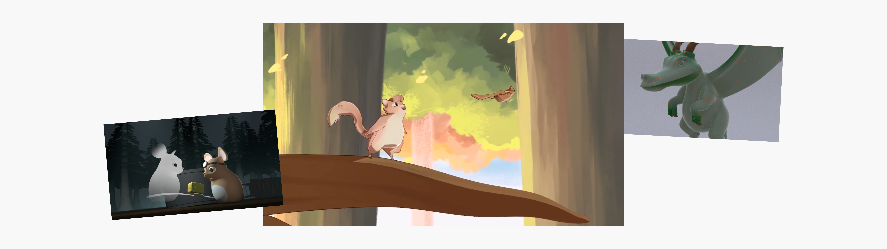

## Context
I was accepted to the University of Washington's Animation Research Labs as a student capstone member. Throughout the course of a year, I worked to learn 3D software for modeling, animation, surfacing, and lighting. The culmination of the year-long project was a 3-minute animated film, following the storyline of a family of flying squirrels. 

Although this project didn't follow the traditional UX process, it gave me the opportunity to learn Autodesk Maya and animation principles. 

## My role
For the first 3 months of this capstone project, we focused in on learning the ins and outs of 3D software. I experimented with modeling, textures, effects, and more. 

In the final animated short film, I was responsible for character animation, texturing/surfacing, and lighting. 

## Concept + set work
I helped to map out our main character's design, complete with sketches from multiple viewpoints. With these sketches, we then created a 3D model and rigging setup for our film. 

Even in an animated film, the set design is key to getting your film to look and feel just right. I helped with concept art work to portray the forest grove we wanted our squirrels to live in. I also worked to surface and texture background elements, such as flowers or ferns that would live within our 3D set. 

This was one of my biggest roles throughout the film, getting our textures and surfaces designed and mapped correctly. I worked to map out UVs for items like the squirrel's acorn outfit, and then mapped both the surface design and texture to give it an acorn-like feel.  These were then translated to the 3D models to give them an accurate look and feel during the film. 

## Animation
Throughout the 3 minute film, I worked on small snippets of character animation throughout. Each clip I worked on was keyframe animated, matched up with our storyboards, and went through rigorous feedback. 

## Final film
At the end of the year, we showcased our film alongside 2 others from different teams in the animation labs. Take a look at the entire video here:

## Parting thoughts
Although this was quite a different project than I was used to, I was eager to learn about 3D software, and can now say I feel familiar with Autodesk Maya. I appreciated getting to learn how to effectively animate, which has been particularly helpful as I tackle UI motion design in my day-to-day work. This project came with a lot of long nights, render issues, and so many learning opportunities. I'm exceptionally grateful for being accepted to this program, and for the skills that it allowed me to develop outside my UX toolkit. 

