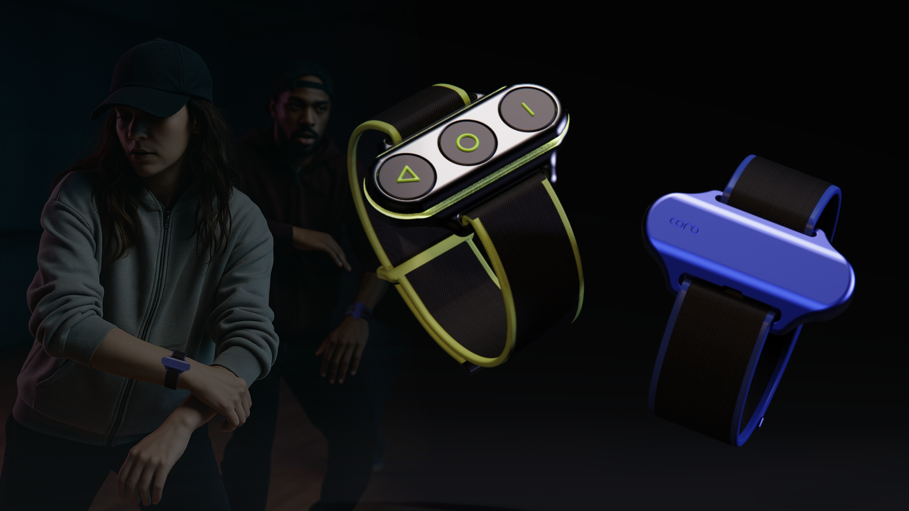
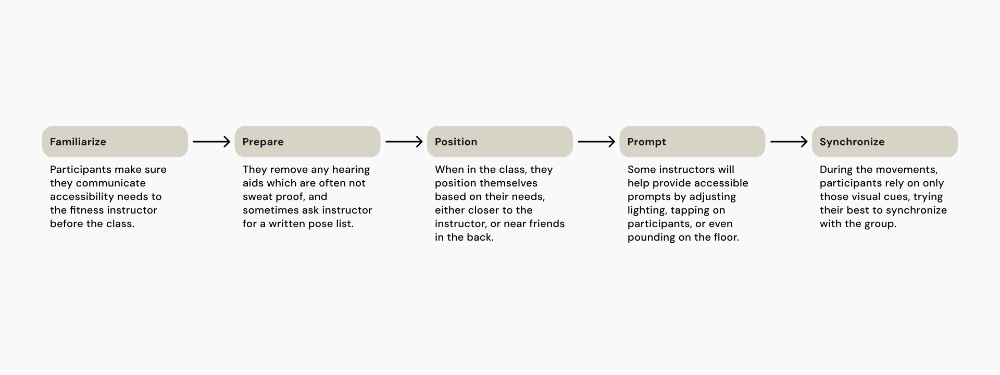
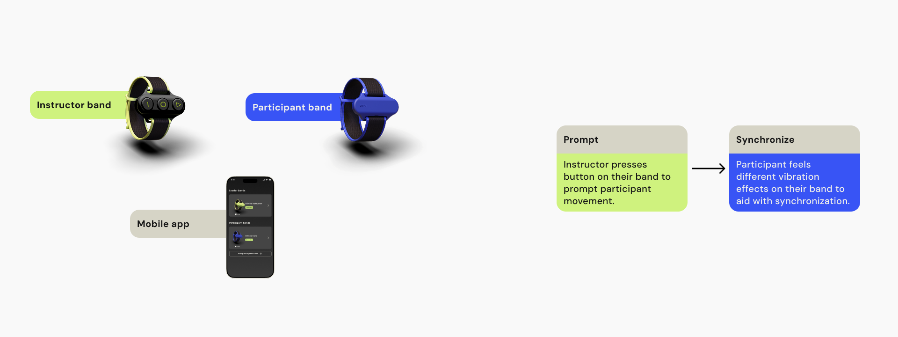
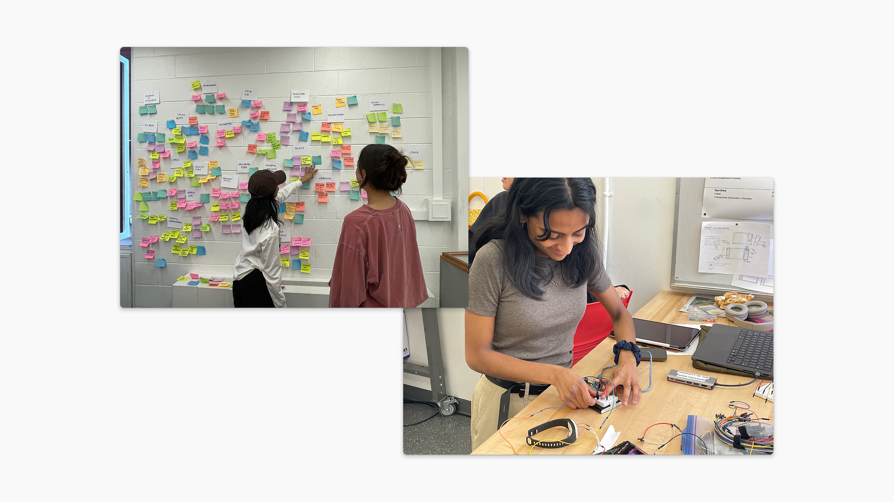
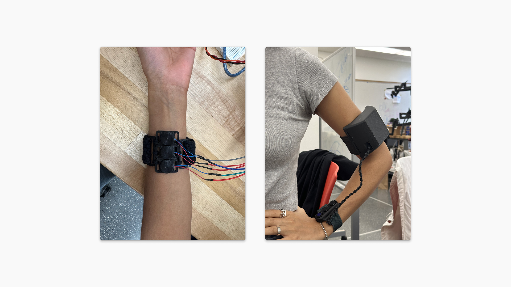

## Redefining communication between instructors and participants in fitness classes, with haptic cues.

    

        
Company

        Brown / RISD
    

    

        
Role

         Team project: Vishaka Nirmal (Interaction Design) Audrey Ji (Industrial Design), Natalia Escobar (Physics/Comp Sci)
    

    

        
Timeline

        Feb 2025 - May 2025 (4 months) 
    

### Context
Fitness classes are not just a place for exercise, but also a space of community and synchronization. My team and I designed CORO as our thesis project at Brown/RISD, with the goal of making sure fitness classes were accessible to all. 

 

**This project was exhibited at the RISD Grad Show from May 21 - May 29 2025, with an interactive demo.**

#### The challenge
## Group fitness is not always accessible.
Across the wide variety of group fitness classes, instructors primarily rely on auditory and visual cues to guide participants. This creates barriers for people who are Deaf or Hard of Hearing, or those who simply benefit from alternative modes of communication. Our research included 10 primary interviews and 3 observation sessions across yoga, dance, and various fitness classes to understand how participants and instructors navigate instruction and synchronization.

Our work was primarily guided by conversations with experts and practitioners at RIT and Brown University, including:
- Matthew Dye, Graduate Program Director in Cognitive Science
- Skip Flanagan, Athletic Coordinator & Deaf athlete
- Amy Stornello, Title IX coordinator & hard of hearing/Deaf yoga instructor 
- Louise Manfredi, Professor in Design Engineering & tactile expert

#### Insights
## A system of synchronization
Synchronization emerged as a central priority across fitness modalities. Instructors consistently aimed to keep everyone moving together--not only for cohesion, but also for safety. We observed how verbal cues, like counting or callouts, were commonly used to foster this sense of rhythm. Amy, a Hard of Hearing yoga instructor, shared that she often relies on environmental cues like lighting changes or pounding the floor to gain participants' attention. Similarly, Skip, a Deaf cheerleading coach, emphasized the power of shared signals: “Sometimes all you need is a big-ass drum.”

 
 

## Technology that disappears
Fitness spaces are often seen as places of disconnection. Phones are put away and the focus is inward. While some participants wear fitness trackers, the presence of tech is minimal. When we prompted participants with ideas for alternative ways to receive instruction, they emphasized a desire for cues that were easy to understand but not disruptive. Kim, a yoga instructor at Brown, captured this ethos best: “What you make needs to disappear.”

#### Solution
## Rethinking prompting and synchronization
With these insights, we reframed the challenge around two core questions: How might instructors discreetly prompt individuals? And how might participants stay in sync with the group? Our journey mapping process helped clarify when, how, and where synchronization breaks down—-and where a gentle, supportive system could step in.

## Quick, simple prompts from the instructor
Our solution centers on enabling instructors to send quick, tactile cues to participants. Each instructor wears a lightweight band with three distinct buttons, each mapped to a specific cue. The tactile button caps help instructors distinguish between cues without needing to look, ensuring ease of use mid-class. This setup supports 1:1 communication and enables accessibility conversations between instructors and participants, without disrupting the flow of the session.
 
 

## A synchronization language with haptics
Once triggered, the participant’s band receives a corresponding signal through vibration motors embedded in the device. Each haptic pattern has a specific meaning:

- Cue – A short countdown that activates each motor in sequence, prompting the participant to look at the instructor for the next step.

- Switch Sides – A quick, sharp nudge using all three motors, signaling it’s time to transition from one side of an exercise to the other.

- Metronome – A rhythmic, repeating pulse of vibrations that participants can easily follow, similar to background music or a heartbeat.

This system creates an intuitive, discreet, and embodied layer of communication that supports everyone in the room, without requiring words or screens.

#### Reflections
## Prototyping interactions, hardware, and everything in between
Although my primary focus was interaction design, I contributed across the board, from hardware and IoT software development to form design and exhibition curation. Our prototypes combined 3D-printed housings and silicone-molded bands, powered by Arduino and Raspberry Pi-based and a custom circuit. The final result was a functional, wearable system that extended inclusivity in movement-based environments—and opened up new ways of thinking about nonverbal instruction in shared spaces.

## Exhibiting our work
To test our system in a real-world context, we designed an interactive, multi-part exhibit that allowed visitors to experience the technology firsthand. The centerpiece was a follow-along demo that mimicked a short fitness routine, guided by the haptic cues we had developed.

The exhibition visitors shared a range of unexpected applications—-from using the system to learn choreography, to organizing flash mobs, or even enhancing concert experiences. The positive feedback reinforced the potential of this system to support synchronized movement in a variety of settings.

