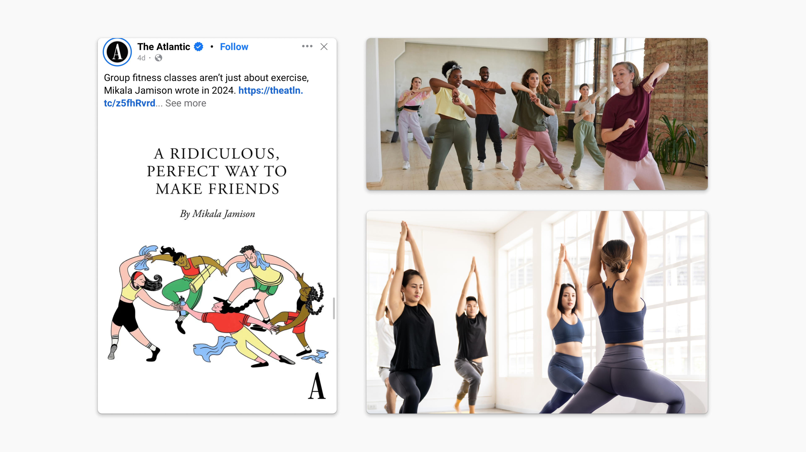

### Coro
> Redefining instructional fitness communication 

**This case study is under construction! 🔨**

    

        
Context

        Interaction Design at Brown University & Rhode Island School of Design
    

    

        
Impact

        Research, design, strategy, and project handoff. Exhibited at the RISD Grad Show from May 21 - May 29 2025 with an interactive demo.
    

    

        
Timeline

        February 2025 - May 2025 (4 months) 
    

>Why alter group fitness classes?
Group fitness classes are not just a place for exercise, but also a space of community and synchronization. Throughout the wide variety of fitness classes, instructors primarily rely on audio and visual cues to direct their participants. With this project, we introduce a new alternative cue: haptic communication, streamlining accessibility for those who are Deaf or hard of hearing.

This project was guided by our connections at RIT, including:
- Matthew Dye, Graduate Program Director in Cognitive Science
- Skip Flanagan, Athletic Coordinator & Deaf athlete
- Amy Stornello, Title IX coordinator & hard of hearing/Deaf yoga instructor 

## My contributions

    

        
Team

        Vishaka Nirmal (Interaction Design), Audrey Ji (Industrial Design), Natalia Escobar (Design Engineer)
    

    

        
Toolkit

        Figma, Physical fabrication, Blender
    

Although my focus was on interaction design, throughout this project I was able to contribute to the IoT software and hardware engineering, form design, and exhibition design. We crafted our prototypes out of 3D printed and silicone molded parts, and used a variety of Arduino and Raspberry Pi based microcontrollers. This case study is in progress, but read more about my design process and view some pictures from the project below:

  

    Research
    learning from those involved with group fitness and experts who are hard of hearing and/or Deaf
  

  

    Ideation
    of alternative communication methods to assist with synchronization
  

  

    Prototyping
    within three main tracks of electronics, haptics, and form prototyping 
  

  

    Validation
    through continous user testing 
  

