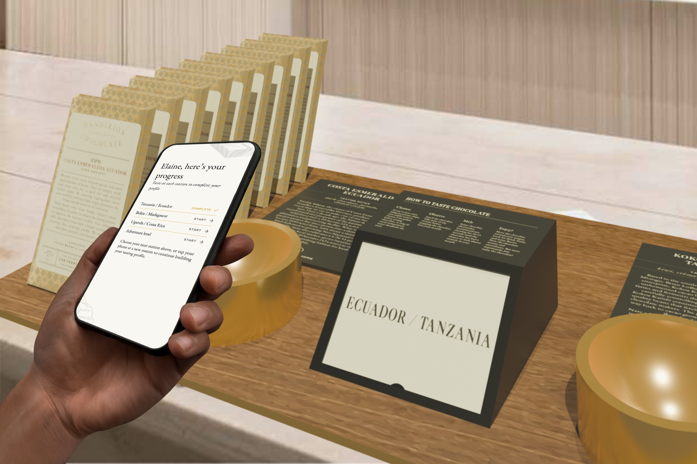
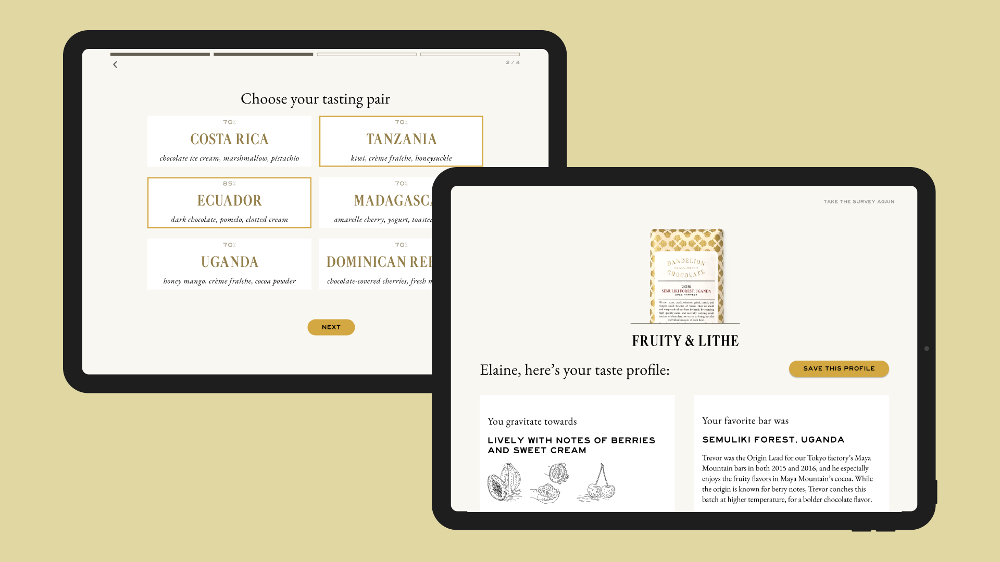

## Dandelion Chocolate
> Designing flavor experiences for in-store and online craft chocolate tasters

    

        
Role

        Researcher & Designer
    

    

        
Setting

        Dandelion Chocolate
    

    

        
Time

        January 2025 (3 weeks) 
    

## About the project
Dandelion Chocolate is a San Francisco-based chocolate company. Their specialty is craft and single-origin chocolate. During my time in the Brown/RISD Masters of Design Engineering program, I had the opportunity to work with on this client project. This project's design process encompassed stakeholder researcher, competitive analysis, concept ideation, prototyping, and handoff. 

The outcome was a **set of design recommendations presented to Dandelion Chocolate** in January 2025. The proposed changes will allow Dandelion to incrementally update their tasting experiences to collect and cater to flavor data. 

## Why tasting experiences?
**Single-origin chocolate is special.** In fact, there's a specific process to taste it! Dandelion has multiple storefronts, which each have a setup of single-origin bars. Since these bars are just cocoa and sugar (unlike most bars with cocoa butter or soy lecithin), the best way to taste them involves a process of cleansing your palate, letting the chocolate melt fully, and then comparing flavors you can taste from each specific bean origin. Currently, their store setup includes a long line of tasting dishes, and customers tend to be uncertain on how to taste or what they're looking for. My work for Dandelion holistically looked at their current tasting experiences and asked the question:  

>How could Dandelion enhance their tastings to provide a more meaningful flavor experience?

## My role

    

        
Team

        Solo project, with collaborator & stakeholder feedback
    

    

        
Toolkit

        Figma, Physical fabrication, Blender
    

This project was completed as a client project through the Brown University & Rhode Island School of Design Wintersession. Although I completed this project on my own, I worked alongside six other students working for Dandelion as they designed for retail pop ups, advent calendar, and factory uniform design. With this group, I was able to gather feedback from my student collaborators as well as relevant Dandelion stakeholders.  

In this project, notable parts of my main design process included:

  

    Research
    to learn from the experts and customers at Dandelion
  

  

    Ideation
    of spatial experience flows that could be augmented with the survey prototype
  

  

    Prototyping
    to facilitate interactions in store/online
  

  

    Validation
    through a simulated testing experience
  

## Research into tasting experiences
To fully grasp the client problem space, I held **two initial stakeholder interviews with Elaine from Dandelion.** In the first, I learned more about her experience with the problem, and in the second, we dove into specifics on how her survey worked and how it could be translated to other platforms. Additionally, I hosted **informal interviews with two classmates who were frequent customers** in San Francisco previously. 

Learning more about the curated tasting experience, I conducted a **competitive analysis to learn from various ‘tasting’ experiences** across teas, soaps, books, and perfumes. Additionally, I documented current ‘pick your product’ surveys that allow customers to find product preferences, looking for key survey techniques. 

From my research, some notable touchpoints came out: 

  

   
Too much information to process 😵‍💫

  In stores, users have a lot of information to process when going through self-guided tasting experiences, which are often set up with upwards of 8 tasting possibilities all at once.
  

  

   
Valued custom recommendations 💌

  Overall, online product surveys allow each company to tailor their product recommendations to each user, and were viewed as a great way to match personal preferences with a product. 
  

Then, synthesizing these findings, I began to map out the current and potential future user flows.

Overall, the improvements in the future user flow stemmed from these design requirements:

  

   
Too much information to process →

  One of my goals was to provide the informational experience in bite-size pieces for users.
  

  

   
Valued custom recommendations →

  The other goal was to allow Dandelion to gather and utilize flavor valuable profile data, facilitating their engagement with customer data.
  

## Ideating a range of concepts
Based on the set user needs, I then began to sketch out concepts for improvements. My initial ideation took two forms, through hand-drawn sketches and wireframes. At this stage, I presented my initial ideas to other student collaborators, gathering feedback on concepts and design sensibilities. 

## Prototyping across digital & physical mediums 
After gathering feedback and narrowing down to an intended solution, I began to create physical artifacts and prototypes on Figma to convey my concepts. At this stage, my goal was to provide a proof of concept and light validation with these solutions. 

## Validating through a student activity
As a class demo, I set up each of my three leading concepts. I walked students through each intended experience, and observed as they interacted with the prototypes. 

## Final concept
The final experiences presented to Dandelion included 3 tracks:

A low lift approach to introduce online-orders to a re-branded digital survey

A medium lift prototype to set up intentional tasting stations across the stores

A high lift concept to set up self-guided tasting stations in stores

## Food for thought
This work was presented to Dandelion in February of 2025 along with all the student teams. We got great feedback from the broader team at Dandelion, who is excited to explore these concepts more. Reflecting on this work, I'm excited about the potential ideas brought to the team, but would love to further explore a few concepts. 

Specifically, I'd be interested in:
1. Contextual inquiry: With the opportunity to be in person at their stores, I would love to run some observation sessions to learn from customers as they go through current/prototyped tasting experiences. 
2. Production & portability: One of my next steps for this project would be to look into the cost for each experience to be implemented across multiple storefronts and pop-ups. 
