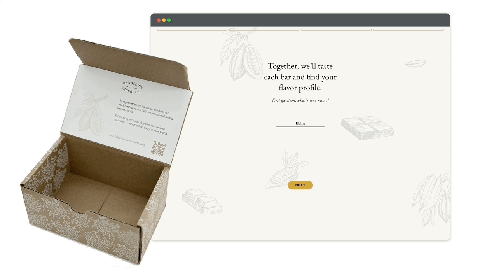

## Envisioning future tasting experiences for Dandelion Chocolate, empowering data-focused taste profiles. 

    

        
Company

        Dandelion Chocolate
    

    

        
Role

        Experience Designer
         
        Lead designer, Solo project
    

    

        
Timeline

        January 2025 - February 2025 (1 month) 
    

### Context
During my Master’s program at Brown/RISD, I partnered with Dandelion Chocolate to rethink their tasting experience across in-store and online touchpoints. The goal was to envision these touchpoints as ways to  gather valuable customer data. **The project resulted in 3 actionable, data-focused proposals to enhance Dandelion’s tasting experience.**

#### The Challenge
## Dandelion was looking for a way to gather customer preferences at their tasting stations.

Dandelion Chocolate is a San Francisco-based chocolate company focused on crafting single-origin chocolate bars. Each bar has a unique flavor profile shaped by the cocoa beans used. They wanted a better way to gather customer taste preferences, with the long-term goal of building individual taste profiles for each customer. I collaborated with Elaine Wherry, who was our client for this project. While I received some peer support during testing, I led the research, design, and ideation phases.

#### Insights
## A line of tasting stations

To fully understand the problem space, I worked closely with Dandelion employees and observed how tastings were currently run in-store. Their storefronts typically feature a long line of tasting dishes set up in a randomized order. Elaine was curious whether the layout could be optimized and made more intentional.

In stores, customers often face a high cognitive load—tasting from 8+ options with little guidance. The self-guided nature of these tastings can make it hard to form comparisons or remember preferences.
 
 

## How to best collect data?

Dandelion was eager to explore how customer flavor preferences could be captured, both in-store and online, to eventually offer personalized recommendations. To broaden our thinking, I also studied other tasting and recommendation experiences across tea shops, soap brands, bookstores, and perfume counters.

Online product surveys proved especially relevant—they personalize recommendations while helping brands learn from user input. These models became a useful reference as we shaped our own survey and tasting concepts.

#### Prototyping
## Digital

After gathering feedback and narrowing down possible directions, I used Figma to develop digital artifacts and prototypes. These helped communicate the core experience and layout ideas clearly to stakeholders.

## Physical

I also created a set of physical prototypes to simulate the in-store tasting experience. This included:

A 3D-printed faceplate that held comparison information at a 45° angle—making it easy to scan from across the tasting table. I also used a reusable paper insert so that the station could adapt if the store layout changed.

#### Validating
## Mock tasting activity

As a class demo, I set up each of my three leading concepts and guided students through the tasting experience. I observed their behaviors and captured feedback. This served as a lightweight validation step, confirming the viability and appeal of each idea.

#### Solution
## Bite-size comparisons

I aimed to simplify the tasting experience by providing flavor comparisons in bite-sized pieces. By framing tastings around pairs of bars, the experience became more focused and approachable.
 
 

## Buildable customer data

The system was designed to let customers move through the tastings either linearly or in an open-ended way. In both cases, Dandelion could capture preference data, helping the brand create more tailored future recommendations.
 
 

## The three tracks

The final concept presented to Dandelion included three implementation tiers:

  

    
Low lift

    A reimagined web experience that introduces online-order customers to a digital flavor survey.
  

  

    
Medium lift

    A guided tasting experience using printed cards, with users following along via their phones.
  

  

    
High lift

    A self-guided tasting station built with in-store tablets for real-time feedback and discovery.
  

## Low lift for tasting online orders

## Medium lift for intentional guided comparisons

## High lift for self-guided tastings

## Food for thought

This work was presented to Dandelion in February 2025 alongside other student teams. We received enthusiastic feedback from the broader Dandelion team, who were excited to explore these ideas further.

Looking ahead, I’d be curious to explore:

1. **Contextual inquiry:** With more time on-site, I’d love to observe real customer behavior and pain points as they navigate current and prototyped tasting experiences.

2. **Production & portability:** I’m interested in the logistics of deploying these tasting setups across Dandelion's stores and pop-up locations—including cost, materials, and implementation timelines.
