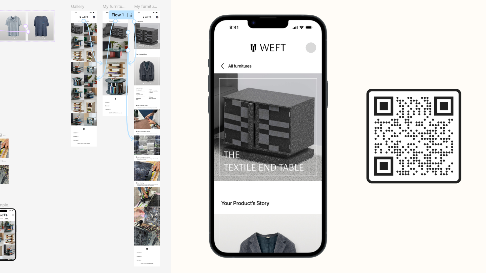
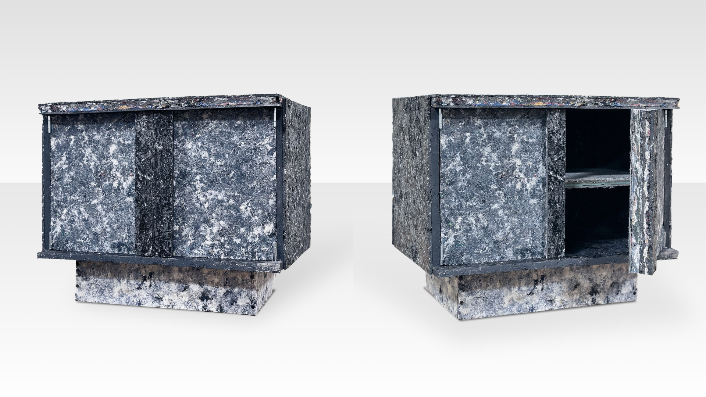

## Dandelion Chocolate
> Designing flavor experiences for in-store and online craft chocolate tasters
| Setting    | Role   | Time  |
|:-------------|:-------------|:--------------------|
| Dandelion Chocolate | Researcher + Designer| January 2025|
| Brown + RISD | | |

## About the project
Dandelion Chocolate is a San Francisco-based chocolate company. Their specialty is craft and single-origin chocolate. During my time in the Brown/RISD Masters of Design Engineering program, I had the opportunity to work with on this client project. This project's design process encompassed stakeholder researcher, competitive analysis, concept ideation, prototyping, and handoff. 

The outcome was a **set of design recommendations presented to Dandelion Chocolate** in January 2025. The proposed changes will allow Dandelion to incrementally update their tasting experiences to collect and cater to flavor data. 

## Context
**Single-origin chocolate is special.** In fact, there's a specific process to taste it! The first call I had with the client stakeholder, Elaine Wherry, she provided valuable insight into the company's goals and values.

In each of their stores, there is a long line of each of the single-origin bars at a tasting station. 

**How could Dandelion enhance their tasting experience to gather/provide more information on flavor profiles?**

## Role
The team went through the holistic research and design process together, but some of my notable contributions included:
- **Research & synthesis** to understand user needs and flows
- **Material prototyping** to create durable boards
- **Experience prototyping** to facilitate user interactions with the product

| Design Team    | Tools   |
|:-------------|:-------------|
| Vishaka Nirmal     | Figma        | 
|  Eunjin Hong | Prusa        | 
| Sarah Fletcher | Fabrication  |
| Bennett Graff |              | 

## Research
To understand sustainability attitudes, we surveyed **51 participants** and conducted **11 semi-structured interviews**. We focused our line of questioning onto how emotional connections might affect user perception on sustainable products.

From our research, we saw that: 
- The average self-rating for interest in sentimental products was 6.34/10 (1 being low interest, 10 being high)
- Emotional connection stems from items that "memorialize cherished moments," such as familial belongings, or event-specific clothing.

We then synthesized these findings, setting requirements for our design that would:
1. **Foster emotional connections** by documenting the story behind the original materials. 
2. **Encourage sustainable consumption** through durable, utility focused products. 

## Ideation
From our research findings, we decided to pursue a two-pronged prototype, including a textile-board created piece of furniture, along with a lasting storyline for that object. We then began to ideate on these two tracks:
1. **Sketches for possible furniture designs** that would be possible to create with textile-boards.
2. **Brainstorming and affinity diagramming on how users could interact with the storyline of each piece,** to deepen emotional connections.

## Prototyping the Physical Product
We developed many prototypes for the textile boards, experimenting with scrap sizes, adhesive amount, and compression amount. With our initial prototypes, we also tested the material strength of these boards by using various tools on them, including the bandsaw, drill press, and track saw.

## Prototyping the Digital Experience
To develop the storyline connected to each piece, we began by building a user journey map to identify key emotional touchpoints. We then ideated what platforms would be most accessible and long-lasting for this story to live on.

We landed on a mobile-first digital experience, that would be activated through a QR code or NFC tag connected to the piece of furniture. We then wireframed a platform where users can:
- **Scan a QR code** embedded in the furniture
- Access their **individualized digital story** of their product's journey

## Final Concept
The final product combines **customizable furniture** with a **digital narrative**. Our prototype encourages long-term use by making each piece personal and meaningful. With this project, our prototype helps to contextualize the future of textile recycling as a viable building material. We hope to break the cycle of fast fashion and fast furniture, by creating memorialized products that hold a greater emotional value to the owner. 

<iframe width="560" height="315" src="https://www.youtube.com/embed/E5rVwSv8zpM?si=mdJBYMrUFEvoDqlh" title="YouTube video player" frameborder="0" allow="accelerometer; autoplay; clipboard-write; encrypted-media; gyroscope; picture-in-picture; web-share" referrerpolicy="strict-origin-when-cross-origin" allowfullscreen></iframe>

## Future Work
With this project, we got to a working prototype of our cabinet that was made entirely with textile scraps, equipped with a QR code to a digital prototype of it's story along the way. 

In the future, we aim to continue working on a couple parts of this project, including:
1. Adhesives: Transitioning from resin to bio-based alternatives (e.g., lignin-based adhesives).
2. Material durability: Enhancing weather resistance and load capacity.
3. Scalability: Personalizing digital stories for large-scale production.
