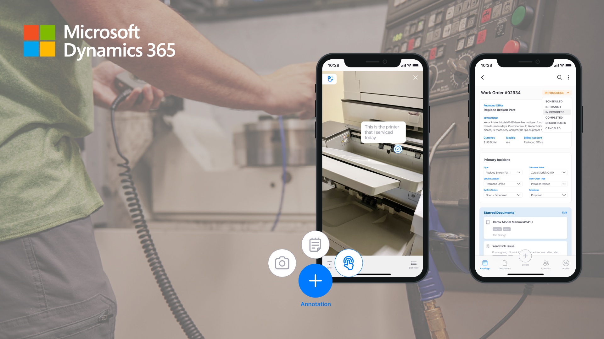

## Microsoft's Field Service Application
> Redesigning a mobile tool for field service technicians to enhance information management.

| Role   | Time  |
|:-------------|:--------------------|
| Designer & Researcher @Microsoft Dynamics 365| January 2021 - June 2021 (6 months)|

**If you have the password from my resume, you can take a look at my case study of this project [here](/fieldserviceapp).**

## About the work
In this student capstone project, partnered with Microsoft Dynamics 365, we were tasked with redesigning the Field Service Application. Our goal was to **improve how field service technicians create, manage, and find resources**.

Throughout this project, my student team and I worked directly with Microsoft to research, design, and handoff solutions for their team. The final deliverable included a proof of concept for a mobile-AR powered application to help technicians find and track information recorded at a jobsite. 