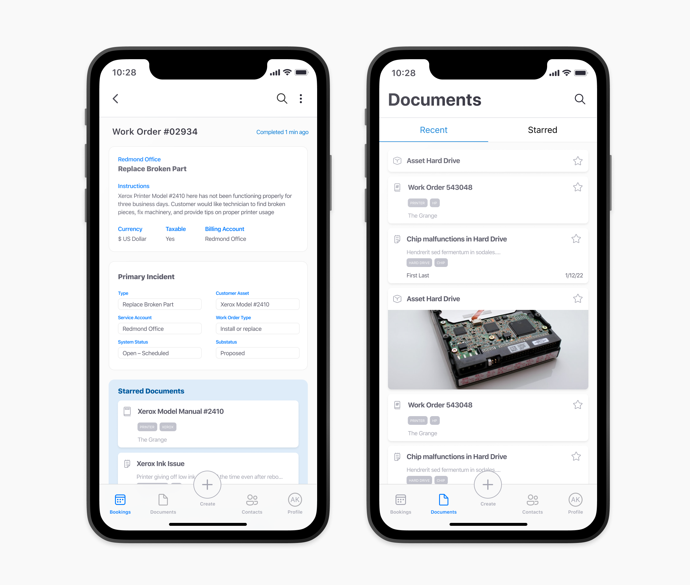

### Microsoft's Field Service Application
> Redesigning an information management tool for service technicians.

    

        
Context

        A capstone project partnered with Microsoft, focused on the future of the Field Service App. 
    

    

        
Impact

        A future-forward vision presented to Microsoft Dynamics 365. 
    

        

        
Timeline

        January - June 2021 (6 months)
    

    

>How might we design a tool for technicians to effectively create, manage, and find resources for their jobs?
Field service technicians work on a variety of devices, often relying on notes and images to document their work. Currently, technician note-taking and resource management on the Field Serivce App is inefficient. The existing application made it difficult for technicians to quickly create and access these resources, leading to inefficiencies and potential errors.

## My contributions

    

        
Team

        Vishaka Nirmal, Alli Hishikawa, Avery Wolf, Kailey Terraciano
    

    

        
Toolkit

        Figma, Usertesting.com, Maze, Snap Lens Studio
    

As part of a student team of four, we collaborated closely with a design manager from the Microsoft Dynamics team. Drew Pusey. While I was involved in all aspects of the process, my most significant contributions were:

  

    Research
    Hosting user interviews with active field service technicians
  

  

    Information architecture
    To restructure the flow of information within the application
  

  

    Usability testing
    to test how well technicians can add and find information
  

  

    AR prototyping
    crafting a future vision for mobile AR embedded into the application
  

## The current application made finding necessary resources time-consuming.
The existing Field Service Application allowed technicians to track their upcoming work through a calendar interface, attaching text or images as resources within each task. However, finding prior resources often required digging through previous documentation or contacting previous technicians, which was time-consuming and inefficient.

## Research into notetaking and field service technician workflows  
To inform our design, we conducted a competitive analysis, examining existing tools in the market. We gathered screenshots of products, noted their functionalities, and identified any novel solutions. For example, one competitor's tool allowed technicians to add notes on top of images taken with their mobile phones, offering a more integrated approach to documentation.

Additionally, we conducted **5 semi-structured interviews with active field service technicians**, recruited through UserTesting. Each 1-hour interview provided us with valuable insights into their workflows and pain points, including some key considerations:

    

        
Note often take different formats

        Technicians often work with a variety of devices and rely on notes, images, and communication with other technicians. 
    

    

        
Quickly finding relevant resources is difficult

        While at a job site, technicians often refer back to notes from previous work orders, which may have been created by other technicians.
    

        

        
Access to expertise

        Junior technicians often need to call other technicians to rely on their expertise while on a job site. 
    

    

## What would need to change in the day-to-day technician journey?
To synthesize our research, I helped map out the user journey for field service technicians, outlining the day-to-day tasks they perform during a work order. This journey map highlighted key pain points and opportunities for improvement in the application.

## Co-ideating solutions with the Microsoft design team  
With a solid understanding of the field service workflow, we conducted a design jam to explore new ideas. I prepared lightning talks on our research findings and facilitated ideation sessions with both our student team and the Microsoft design team. The result of this session was early stage wireframes and feedback from the team. Here are a couple of my sketches and synthesis tools used during the session:

## Rethinking the app's centralized information architecture
After sorting through our ideas, we mapped them back to the pain points identified in the user journey map. This process led us to refine the information architecture of the Field Service Application, ensuring that each new feature was housed in the most intuitive location.

## Validating our designs with usability testing
Once we had our concepts mocked up, we used Maze and Usertesting.com to conduct usability tests with three active field service technicians. We tested the following tasks:

1. **Finding and editing current work orders**
2. **Attaching documentation to a current work order**
3. **Submitting the final work order**

We identified minor usability concerns, such as users struggling to navigate due to unclear labeling in the app's navigation. We saw excitement for in-app calling and annotation capabilities, validating our initial pathway. 

## Final Designs
The redesigned application prioritizes technician efficiency in finding and documenting information. We created designs to showcase key pathways a technician would take: 
- Getting ready for upcoming work orders
- Finding relevant resources while at a job site
- Creating and attaching notes to current work orders
- Collaborating with another technician remotely

## Easily reference relevant content in Booking and Documents
The final solution allows technicians to easily access work orders through the ‘Bookings’ page, and information through the ‘Documents’ page. I took specific ownership over the Documents page to easily show recent and starred documents, where each resource is tagged with relevant information. 

## Search and add resources to a work order quickly
As a technician searches for resources on the job, starred documents are automatically attached to the active work order, making the information collection process easier. 

## Utilizing mobile AR for contextual notes 
Incorporating augmented reality into this solution, our central navigation caters to quick note creation. Choosing from an image, text note, or augmented reality annotation, technicians can easily place a note in space. 

Similarly, through the contacts page, technicians can gain access to their peers, adding in augmented reality into their video calls. Their remote collaborators can help to point out or draw on top of the video from their in-person counterpart. After a video call, each markup is kept with a static image from the time it was placed, allowing technicians to easily attach this annotation to their documentation.

## Final handoff of this concept to Microsoft
Our final deliverable for this project was a future vision video, along with an annotated Figma file. This handoff provided Microsoft with a detailed concept that allows technicians to easily create, search for, and manage information throughout their work. [You can watch the video here!](https://www.youtube.com/watch?v=hZSgOsm4DRg&list=LL&index=1)

## Reflections
Our team was excited to incorporate augmented reality into this future vision. Before this project, I had minimal experience with augmented reality on mobile devices. To prototype the experience, we used a combination of Snap Lens and Adobe After Effects. 

While the prototype was somewhat limited, preventing us from testing the AR features with active technicians, it sparked my interest in developing full, testable mixed-reality prototypes in the future.

This project marked the culmination of my university experience at the University of Washington. The industry connection with Microsoft and the six months of collaboration with my peers made it a memorable and rewarding experience. Working together on Zoom and Figma chat, we brought our ideas to life and created a meaningful solution for field service technicians.