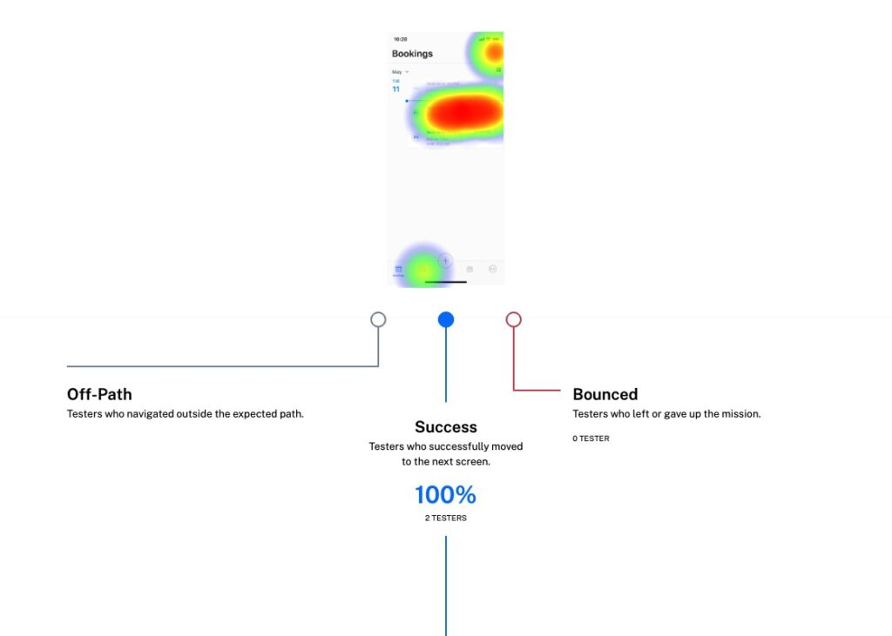

## Microsoft's Field Service Application
> Redesigning a mobile tool for field service technicians to enhance information management.

## Background
> A capstone project with Microsoft Dynamics 365 to enhance field service documentation.

In this student capstone project, partnered with Microsoft Dynamics 365, we were tasked with redesigning the Field Service Application. Our goal was to improve how field service technicians create, manage, and find resources during their tasks, focusing on a tool that could enhance their workflow.

    

        
Team

        Vishaka Nirmal, Alli Hishikawa, Avery Wolf, Kailey Terraciano
    

    

        
Tools

        Figma, Maze, UserTesting.com
    

    

## Problem
> Technician note-taking and resource management is inefficient.

Field service technicians work on a variety of devices, often relying on notes and images to document their work. However, the existing application made it difficult for technicians to quickly create and access these resources, leading to inefficiencies and potential errors.

This led to our defining question:

**How might we design a tool for technicians to effectively create, manage, and find resources for their jobs?**

## Role
As part of a student team of four, I collaborated closely with a design manager and a designer from the Microsoft Dynamics team. While I was involved in all aspects of the process, my most significant contributions were:

- **Information architecture**
- **Final note-taking flows**
- **Final documentation flows**

## Current application
> Finding necessary resources is time-consuming.

The existing Field Service Application allowed technicians to track their upcoming work through a calendar interface, attaching text or images as resources within each task. However, finding prior resources often required digging through previous documentation or contacting previous technicians, which was time-consuming and inefficient.

## Competitive Analysis
> Within the competitive landscape, notetaking was broader than just text-based notes.

To inform our design, we conducted a competitive analysis, examining existing tools in the market. We gathered screenshots of products, noted their functionalities, and identified any novel solutions. For example, one competitor's tool allowed technicians to add notes on top of images taken with their mobile phones, offering a more integrated approach to documentation.

## User research
> How do current field service technicians manage these inefficiencies?

We conducted semi-structured interviews with five active field service technicians, recruited through UserTesting. Each interview lasted one hour, providing us with valuable insights into their workflows and pain points.

💡 **Interviews insight**

Technicians often work with a variety of devices and rely on notes, images, and communication with other technicians. At job sites, they need to quickly create and access these resources to perform their tasks efficiently.

## Synthesis
> Finding and documenting information were the biggest themes of pain points for technicians.

To synthesize our research, I helped map out the user journey for field service technicians, outlining the day-to-day tasks they perform during a work order. This journey map highlighted key pain points and opportunities for improvement in the application.

## Ideation
> These problems required big thinking, leading us to a blue-sky design jam.

With a solid understanding of the field service workflow, we conducted a design jam to explore new ideas. I prepared lightning talks on our research findings and facilitated ideation sessions with both our student team and the Microsoft design team.

## Information architecture
> How could we restructure the application's architecture to allow for easy finding and documenting?

After sorting through our ideas, we mapped them back to the pain points identified in the user journey map. This process led us to refine the information architecture of the Field Service Application, ensuring that each new feature was housed in the most intuitive location.

## Usability Testing
> Validating our designs with real users.

Once we had our concepts mocked up, we used Maze to conduct usability tests with three active field service technicians. We tested the following tasks:

1. **Finding and editing current work orders**
2. **Attaching documentation to a current work order**
3. **Submitting the final work order**

💡 **Usability insight**

We identified minor usability concerns, such as users struggling to navigate due to unclear labeling in the app's navigation.

## Final Designs
> The redesigned application, prioritizing technician efficiency in finding and documenting information.

The landing page prioritizes updated, relevant information for technicians. From here, they can view upcoming work as well as unscheduled work orders. Within each work order, all information on location, background, and relevant documentation is consolidated for easy access.

The central navigation button in the Field Service Application is designed to allow technicians to quickly create documentation while working. As they complete work orders, they can easily create a note, asset, or AR annotation that connects to the current specified work order.

The variety of text, image, and AR notes allows technicians to efficiently keep track of their thoughts. With location tracking, each note is automatically added to the in-progress work order, streamlining the documentation process. 

We learned that technicians often encounter new devices at each job site. To provide context on previous work, augmented reality can anchor this information at the job site itself, encouraging the creation of quick, contextually relevant notes.

The search experience was designed to allow technicians to easily find and attach relevant resources to their work orders. When a resource is starred, it is automatically added to the current work order, simplifying record-keeping.

The documents on this page include a wide range of resources, from manuals and quick notes to images from past work orders. Our interviews highlighted the need for a solution that could accommodate various note formats and ensure efficient access to information.

## Handoff
> Delivering a comprehensive, future-focused solution to Microsoft.

Our final deliverable for this project was a future vision video, along with an annotated Figma file. This handoff provided Microsoft with a detailed concept that allows technicians to easily create, search for, and manage information throughout their work. [You can watch the video here!](https://www.youtube.com/watch?v=hZSgOsm4DRg&list=LL&index=1)

## Reflections
> Gaining insights into mixed reality and reflecting on a significant project.

Our team was excited to incorporate augmented reality into this future vision. Before this project, I had minimal experience with augmented reality on mobile devices. To prototype the experience, we used a combination of Snap Lens and Adobe After Effects. 

While the prototype was somewhat limited, preventing us from testing the AR features with active technicians, it sparked my interest in developing full, testable mixed-reality prototypes in the future.

This project marked the culmination of my university experience at the University of Washington. The industry connection with Microsoft and the six months of collaboration with my peers made it a memorable and rewarding experience. Working together on Zoom and Figma chat, we brought our ideas to life and created a meaningful solution for field service technicians.