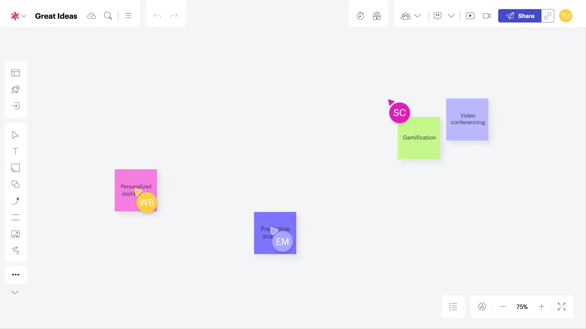
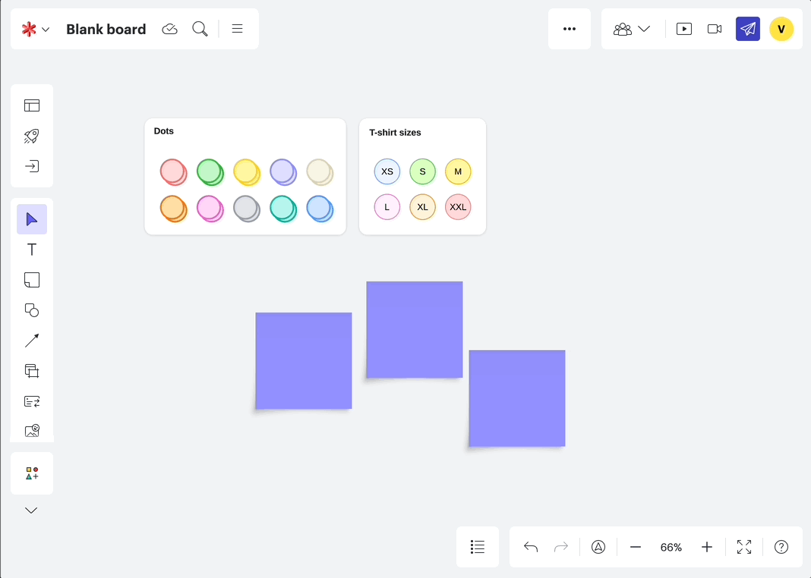
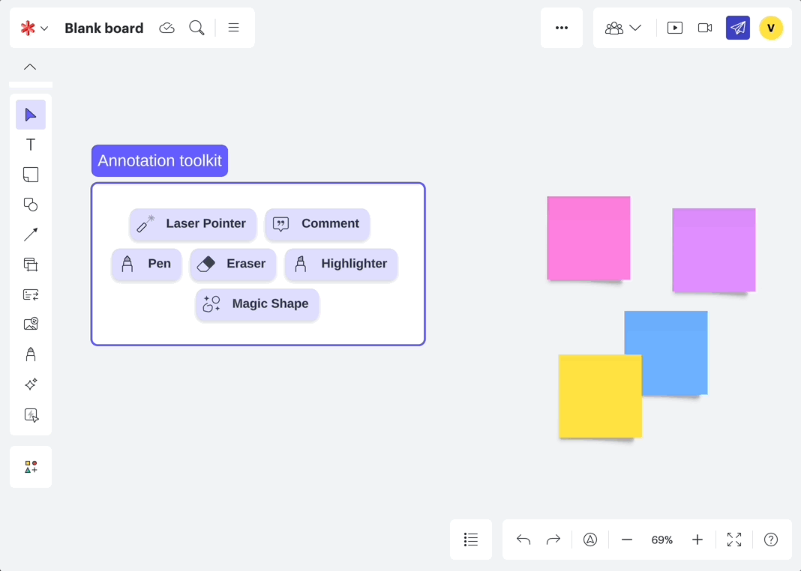
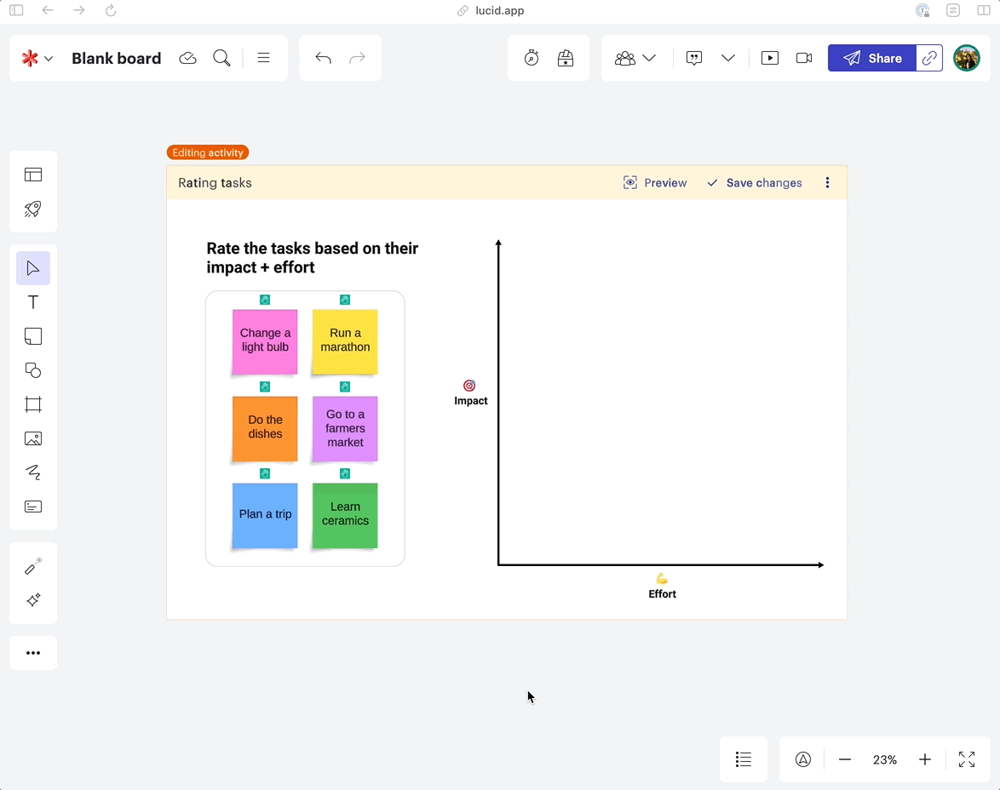
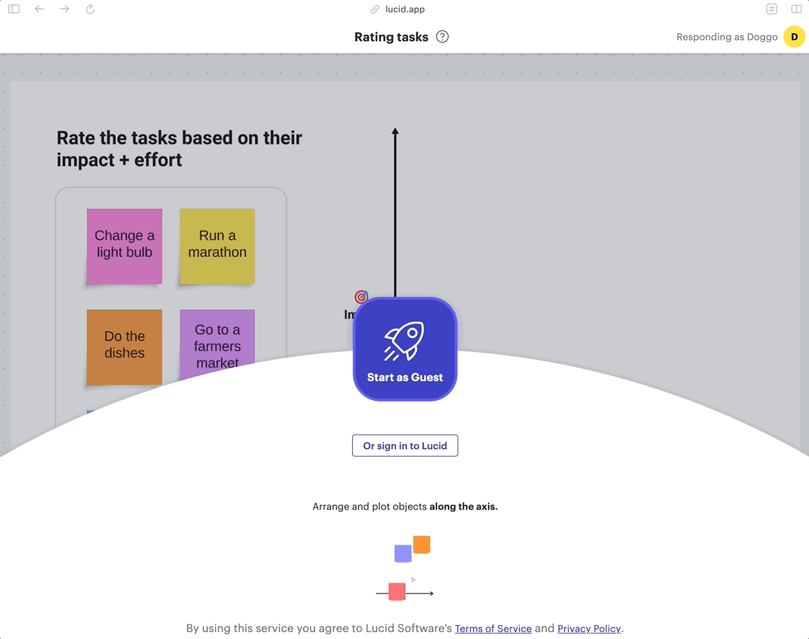
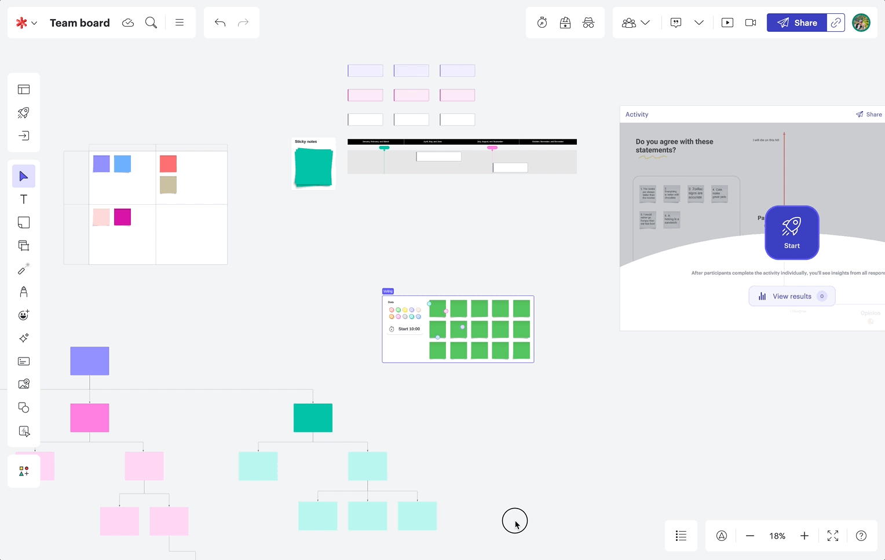

## Lucid Software
> Helping distributed teams collaborate effectively on the virtual canvas.

| Role   | Time  |
|:-------------|:--------------------|
| User Experience Designer @Lucid Software| June 2020 - July 2024 (4 years)|

**If you have the password from my resume, you can take a look at my case studies for [Quick Tools](/quicktools) and [Visual Activities](/visualactivities).**

Otherwise, scroll through the live versions of this work below ↓

## About the work
Distributed teams often turn to the virtual canvas as their collaboration environment, looking for tools to help them communicate, plan, and make decisions effectively. My work at Lucid focused on **understanding how teams work together in a virtual environment**, pinpointing needs and pain points throughout their collaborative efforts.

Throughout my time at Lucid I worked on a variety of teams, and was able to lead out multiple large scale projects through design strategy, concept development, usability testing, and final handoff.

## Selected projects
This selection of projects showcases my journey at Lucid, starting as a UX intern in 2020 and culminating in my role as the youngest Senior UX Designer at the company. My most recent project, Quick Tools, involved leading 0→1 product development, transforming my winning 2023 hackathon concept into a fully launched feature set. I collaborated closely with Directors and C-Suite executives to bring this vision to life.

## [Quick tools](https://training.lucid.co/quick-tools/1954453), Senior UX Designer (2024)

## [Visual Activities](https://lucid.co/resources/webinars/use-cases-for-visual-activities-jan-2024), UX Designer II (2022)

## [Facilitator toolkit](https://lucidspark.com/solutions/facilitation-tools), UX Designer I (2021)

## Shapes in Use, UX Intern (2020)

