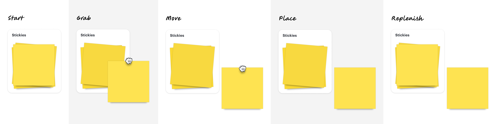
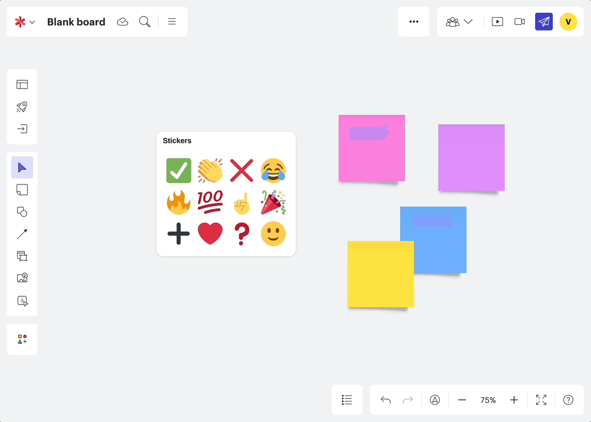

## Creating the future of Lucid's smart templates, with the new feature: Quick Tools. 

    

        
Company

        Lucid Software
    

    

        
Role

          Senior UX Designer
           
          Lead designer for 3 Agile teams
    

    

        
Timeline

        July 2023 - July 2024 (1 year) 
    

### Context
In 2023, I pitched a winning Hackathon project to build on-canvas widgets for Lucid’s virtual canvas tools. Following my team's 1st place finish, I then led strategic efforts to integrate the feature across our product suite. This work resulted in a toolkit of 30+ Quick Tools, **released to all 100 million Lucid users, and is now embedded in over 75% of Lucid templates.** You can now try this feature out [on any Lucid platform](https://x.com/LucidSoftware/status/1804213038121115850?lang=en). 
 
 

#### Challenge
## Why do whiteboard templates need to be smart?
Prior to this project, my hackathon team and I noticed how integral whiteboard templates were to our users. Teams would use templates to learn the tool, run meetings, or just grab content that they wanted to adjust. But Lucid's templates were static and required users to find the tools they needed in the UI.  

## This project began as a Hackathon concept
During the 2023 Lucid Hackathon, my team and I imagined the concept of having 'smart' templates, that would provide dynamic links and tools to everything you needed, at your fingertips. Quick Tools was then developed during Lucid’s 2023 hackathon, where my team and I **won first place in the "Build to Delight" category.**

#### Insights
## How could this new tool support new and experienced whiteboard users?
During the hackathon, user research conducted by Erin Lilly quickly validated our idea. One product manager remarked that the tools **“helped participants focus on content rather than learning how to use the tool.”** After the hackathon, I led continous user interviews with paid, free, and enterprise users at Lucid to understand their needs with smart templates. Our main findings were that:

  

   
New users got lost

New users found it hard to find the tools they need, being unfamiliar with the product. 
  

  

   
Facilitators prepped everything

Experienced facilitators wanted to help get their team up to speed using a digital whiteboard, and would have workarounds to get everyone to find and use the same tool.  
  

#### Strategy
## Leading cross-functional conversations 
Following our hackathon success, I led discussions with Product, UX, and Marketing leadership to secure investment in shape banks and quick actions. Using our research and internal testing, we demonstrated that these tools would:

  

   
Accelerate

Help speed up individual and team workflows.
  

  

   
Discover

Enhance discoverability of hidden features based on a customer's use case.
  

   
Facilitate

Enable facilitators to curate focused participation experiences.
  

To steer these conversations, I created high level template mocks, showcasing how these new widgets could enhance current template offerings:

## How would creating these new widgets on the canvas affect our interface design system?

Once we had buy in, we were able to secure a full development team dedicated to implementing this feature in production. However, one more obstacle we needed to solve was how this would fit into Lucid's design system on and off the canvas. I worked closely with our design systems team to come up with a proposal for the look and feel of these new widgets, matching what our current canvas shapes looked like, while attempting to feel in the same family as our UI system components so users understood how to interact with them. 

#### Hackathon to Production
## Refining interactions, specifications and visuals
With product and design leadership buy-in, I collaborated with our new development team to further develop Quick Tools. **With this new team, we drafted new OKRs and KPIs related to increasing template utilization rates for new and existing users.** Working closely with my product manager, James Webb, I helped scope out 2025 roadmaps, define upcoming sprint work, and refine backlog UX bugs. Our overall goals were to:

  

   
Primary: Hackathon→Production

Fully transition Quick Tools from its hackathon state to a polished product.
  

  

   
Secondary: Future visioning

How could we design these tools to be easily scalable as we add features over the next 5 years? 
  

## Validating with our users
With user interviews, observation sessions, and usability testing, we refined quick tools in an agile development cycle. Beyond initial hackathon research, I conducted three major research initiatives, including usability testing and participatory design exercises. 

In addition to formal studies, I regularly engaged with users through weekly calls to gather feedback and insights, which informed continuous improvements to the product.

#### Solution
## Shape banks
On-canvas shape stacks that allow you to easily add new instances of a shape. Here are the different interaction states with a sticky note shape bank:

Here is an example of the emoji shape banks in a production environment:

## Actions
On-canvas buttons that would allow you to quickly open/use any tool within the Lucid suite. Here are the different interaction states with a timer action:

Here is the final action button in a production environment, showcasing one of our hard to find features, switching between Lucidspark (whiteboarding) and Lucidchart (diagramming):

## Outcomes
Since the launch, we've seen over 100,000 uses of quick tools each month. This project provided the space for me to lead a project from initial strategy to final development. This work was prominently featured in Lucid’s 2024 mid-year release webinar, and these widgets have been added to existing and new templates to enhance user experiences.

