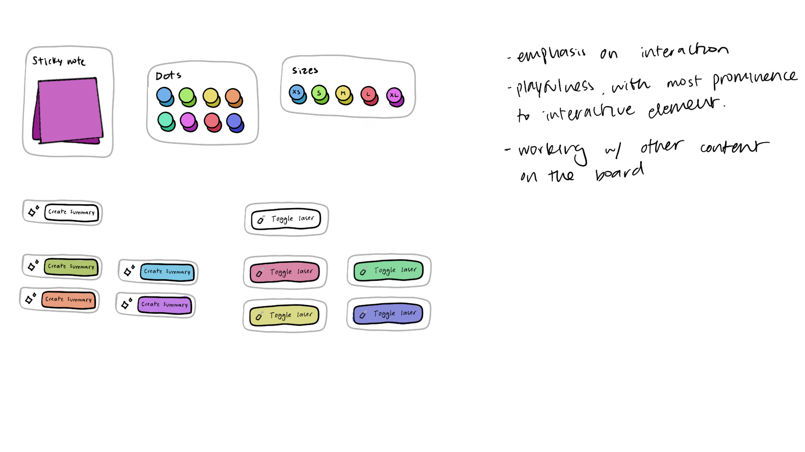
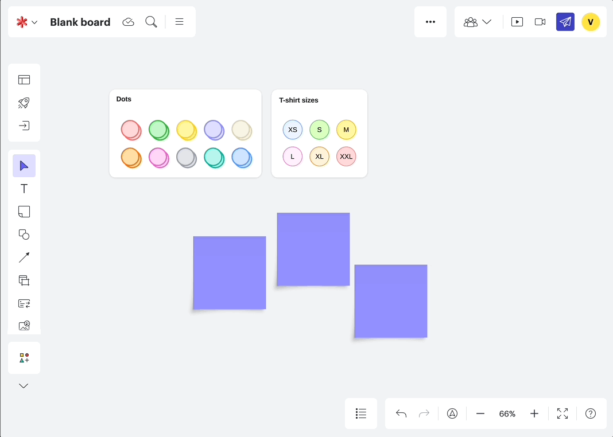

## Context 
Users on a virtual canvas often start with a bad case of ‘blank canvas syndrome.’ What’s the best way to get started with your creative work when you’re placed in an infinite abyss? Thankfully, Lucid had built up a library of thousands of canvas templates, ranging from basic mind maps to cloud architecture diagrams. 

In this project, I had the opportunity to further enhance Lucid’s smart template capabilities, allowing users to easily get started with the tool’s robust features right from these templates. 

## My role

The initial concept of Quick Tools began during Lucid’s 2023 hackathon. My team and I brainstormed the initial iterations of shape banks and action buttons on the canvas, and our project won first place in our Build to Delight category. 

After the hackathon, I led UX strategy, user research, and design work for my scrum team. We officially launched Quick Tools to all Lucid users in June 2024. 

## The hackathon prototype

The team I worked with consisted of myself (Design), Erin Lilly (Research), Ryan Stringham (Engineering), Jarom Chung (Engineering), Brian Campbell (Engineering), Kevin Reece (Engineering), Monica Perez Martin (Engineering), and Nels Ballard (Engineering). 

Our team was formed with the goal of improving Lucid’s template offerings. After multiple brainstormin sessions, we set our goal to create on-canvas tools to enhance current templates. 

The team’s user researcher, Erin, helped us quickly gather user interest from external customers. We immediately heard feedback that our idea resonated. A product manager for an online billing company who facilitates team sessions mentioned that these “tools pruned by the facilitator would be helpful to keep participants focused on the content as opposed to learning how to use the tool.”

## Strategic pitch

After our team’s success at the hackathon, we got to push our idea to the next year’s roadmap. As the lead designer, I led conversations with Product, UX, and Marketing leadership to make the case for development teams to invest in shape banks and quick actions. By using our initial hackathon research findings, and testing internally with stakeholders, we came to the conclusion that this work would help:

- Accelerate an individual’s work and a team’s work
    - Quickly access your necessary tools without navigating the toolbar
    - New collaborators can discover features easily on canvas (instead of hidden in UI)
- Curate facilitation 
    - Facilitators can curate a focused participation experience (participants only use this type of content that is available on the canvas/within my template)

## Design iteration

Once we had buy in, I began working with the new development team that was spun up for this effort. One of our team’s OKRs was to increase our template utilization rate. With this goal, we set up streams of work to improve and build upon the quick tools we built in the hackathon.

I worked with my product manager, James Webb, to outline the team’s goals and roadmap for the year. Collaborating closely with our sister teams, we presented and finalized our product/ux priorities with various leadership groups. Throughout this work, I created both high level concept mocks for the future, as well as specific mocks to polish the quick tool experience from it’s hackathon state. 

## User validation

Apart from our initial research from the hackathon, I ran 3 larger research efforts throughout my time on this team. These research projects ranged from unmoderated usability interaction testing, to moderated participatory design exercises. 

Outside of these efforts, I also continuously learned from internal and external users of the product. I held an average of 2 weekly calls with users to learn about their usage of the product. 

## The quick shape bank

From our user research and strategic lens, we knew that these widgets needed to allow users to easily create and recreate shapes on the canvas. We initially focused on the shape bank styling. We created stacks of items to indicate that these were items users could pull off to create new shapes. We iterated on our sticky note shape bank, adding one that respects each collaborator’s specific color. Lastly, I designed the custom shape bank to allow users to place any canvas object inside, creating their own bank to pull from.  

## The quick action

From our user research, we learned that quick actions needed to simply be a button on the canvas. Users were able to understand that an icon and text meant that this item would run an action on click. 

We wanted to honor this user mental model, while also allowing them to configure and style the shapes easily. I worked on multiple interaction iterations to come to a final hover and padding state to allow users to select items from near the edges of the quick actions. 

As we finalized these minor interactions, I also worked closely with the content and marketing teams to review all user-facing messages within each quick action. 

## The entry point

Lastly, we needed to finalize an entry point for the quick tools in our two canvas products, Lucidspark and Lucidchart. As I designed for this entry point, I initially designed a more robust gallery-like experience to house these tools. Upon further discussions with both product teams, we opted for a list-panel approach, as these had seen usage successes in recent A/B testing within Lucidspark. 

## Outcomes
Quick tools was launched in June 2024, and featured in the June Lately at Lucid webinar.