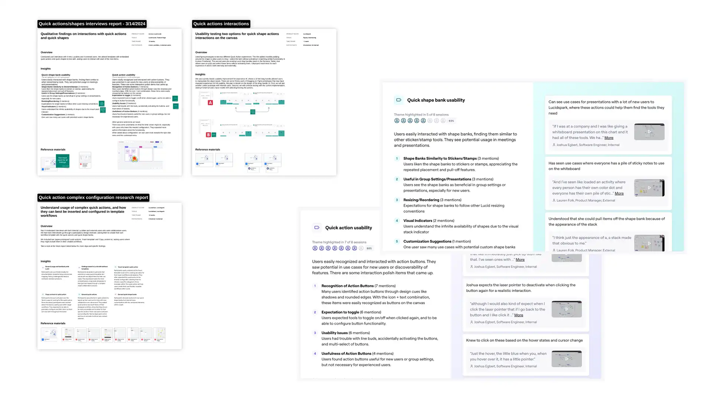

### Lucid Software
> Designing the newest canvas widgets for Lucid's smart templates. 

    

        
Context

        Senior UX Designer for Lucid Software
    

    

        
Impact

        Research, design, strategy, and project handoff. Launched in June 2024.  
    

    

        
Timeline

        July 2023 - July 2024 (1 year) 
    

>How could smart templates engage Lucid's returning and active users?
Quick tools was designed to be a new set of dynamic canvas widgets for Lucid Software's virtual canvas tools, including Lucidchart, Lucidspark, and Lucidscale. Throughout this work, I helped to lead the strategic and design work for this project. Initiating from my team's winning hackathon project, this work **launched to all Lucid users in June 2024.**

## My contributions

    

        
Team

        Lead designer for Lucid's Workflows product team
    

    

        
Toolkit

        Figma, After Effects
    

## Why do whiteboard templates need to be smart?
Prior to this project, my hackathon team and I noticed how integral templates were to our users. Teams would use templates to learn the tool, run meetings, or just grab content that they wanted to adjust. But Lucid's templates were static and required users to find the tools they needed in the UI.  

## Hackathon concept
We imagined the concept of having 'smart' templates, that would provide dynamic links and tools to everything you needed--at your fingertips. Quick Tools was then developed during Lucid’s 2023 hackathon, where my team and I **won first place in the "Build to Delight" category.**

## Researching for whiteboard needs
During the hackathon, user research conducted by Erin Lilly quickly validated our idea. One product manager remarked that the tools **“helped participants focus on content rather than learning how to use the tool.”**

After the hackathon, I led continous user interviews with paid, free, and enterprise users at Lucid to understand their needs with smart templates. Our main findings were that:

  

   
New users got lost

New users found it hard to find the tools they need, being unfamiliar with the product. 
  

  

   
Facilitators prepped everything

Experienced facilitators wanted to help get their team up to speed using a digital whiteboard, and would have workarounds to get everyone to find and use the same tool.  
  

## Leading strategic conversations 
Following our hackathon success, I led discussions with Product, UX, and Marketing leadership to secure investment in shape banks and quick actions. Using our research and internal testing, we demonstrated that these tools would:

  

   
Accelerate

Help speed up individual and team workflows.
  

  

   
Discover

Enhance discoverability of hidden features based on a customer's use case.
  

   
Facilitate

Enable facilitators to curate focused participation experiences.
  

However, one of our larger questions with this project was:
> How would creating these new widgets on the canvas affect our interface design system? 

I worked closely with our design systems team to come up with a proposal for the look and feel of these new widgets, matching what our current canvas shapes looked like, while attempting to feel in the same family as our UI system components. 

## Iterating designs
With leadership buy-in, I collaborated with a new development team to further develop Quick Tools. Our objective was to increase template utilization by refining and expanding the tools.

Working closely with my product manager, James Webb, I created high-level concept mocks to guide our vision for possible tools, as well as detailed interaction specifications to transition Quick Tools from its hackathon state to a polished product.

## Validation of the concept
With user interviews, observation sessions, and usability testing, we refined quick tools in an agile development cycle. Beyond initial hackathon research, I conducted three major research initiatives, including usability testing and participatory design exercises. 

In addition to formal studies, I regularly engaged with users through weekly calls to gather feedback and insights, which informed continuous improvements to the product.

## Final designs
The final set of widgets created during this project includes Quick Shape Banks, and Quick Actions. 

## Quick shape banks
Our research guided the development of widgets that allowed users to create and reuse shapes easily. We emphasized intuitive design, like stackable items in the shape bank and customizable shape banks for personalized use.

## Quick actions
Quick actions were designed to be simple yet effective, with buttons on the canvas that users could easily understand and interact with. I refined interactions to ensure a seamless user experience, including precise hover and padding states.

## Outcomes
Since the launch, we've seen over 100,000 uses of quick tools each month. This project provided the space for me to lead a project from initial strategy to final development. 

This work was prominently featured in Lucid’s 2024 mid-year release webinar, showcasing the impact of our work on enhancing template experiences.
