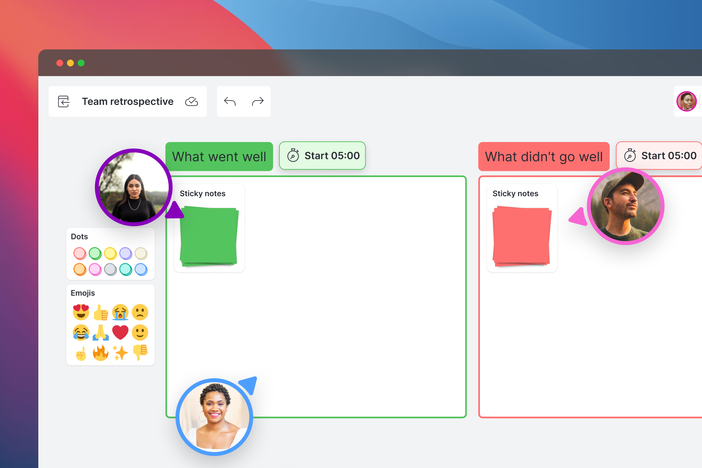
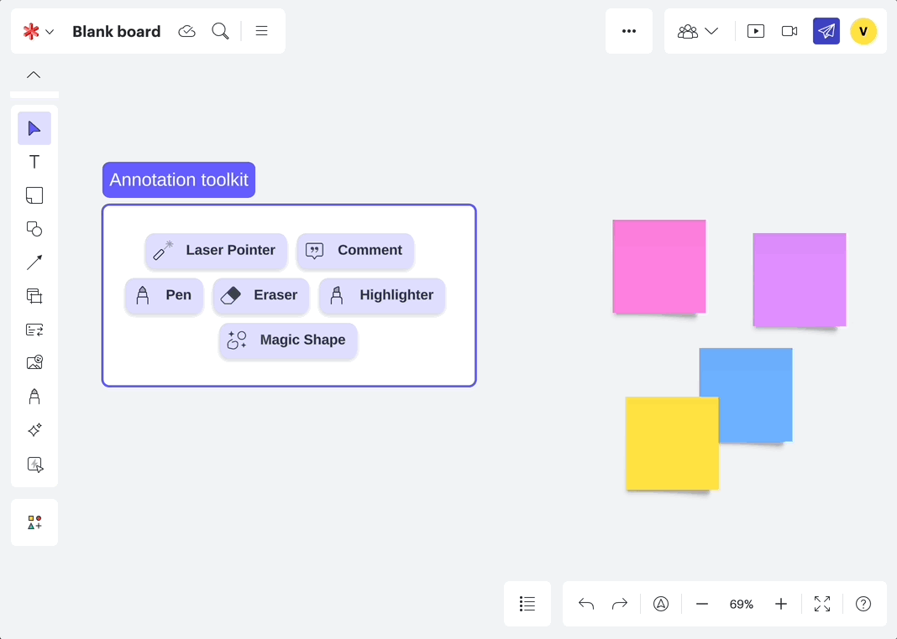

## Lucid Software's Quick Tools
> Designing the newest canvas widgets for Lucid's smart templates. 

| Role   | Time  |
|:-------------|:--------------------|
| Senior UX Designer @Lucid Software | July 2023 - July 2024 (1 year)|

## About the project 
Quick tools was designed to be a new set of dynamic canvas widgets for Lucid Software's virtual canvas tools, including Lucidchart, Lucidspark, and Lucidscale. Throughout this work, I helped to lead the strategic and design work for this project. Initiating from my team's winning hackathon project, this work **launched to all Lucid users in June 2024.**

## Why this project?
Prior to this project, my hackathon team and I noticed how integral templates were to our users. We imagined the concept of having 'smart' templates, that would provide dynamic links and tools to everything you needed--at your fingertips. 

Quick Tools was then developed during Lucid’s 2023 hackathon, where my team and I created the initial iterations of shape banks and action buttons. **Our project won first place in the "Build to Delight" category.**

## My role
| Team    | Toolkit   |
|:-------------|:-------------|
| Lead designer    | Figma, After Effects  | 

My work for this project began during the hackathon, but afterwards, I led UX strategy, user research, and design for the Quick Tools feature.

## Researching for whiteboard needs
Although there was internal reception to this project, we needed to understand if this was valuable with our users.

During the hackathon, user research conducted by Erin Lilly quickly validated our idea. One product manager remarked that the tools **“helped participants focus on content rather than learning how to use the tool.”**

After the hackathon, I led continous user interviews with paid, free, and enterprise users at Lucid to understand their needs with smart templates. Our main findings were that:
- New users found it hard to find the tools they need
- Experienced users wanted to help get their team up to speed using a digital whiteboard

## Leading strategic conversations 
Following our hackathon success, I led discussions with Product, UX, and Marketing leadership to secure investment in shape banks and quick actions. Using our research and internal testing, we demonstrated that these tools would:

- Accelerate individual and team workflows.
- Enhance discoverability of features on the canvas.
- Enable facilitators to curate focused participation experiences.

However, one of our larger questions with this project was:
> Would creating these widgets be adding UI to the canvas? How would we define what this looks like?

I worked closely with our design systems team to come up with a proposal for the look and feel of these new widgets, matching what our current canvas shapes looked like, while attempting to feel in the same family as our UI system components. 

## Iterating designs
With leadership buy-in, I collaborated with a new development team to further develop Quick Tools. Our objective was to increase template utilization by refining and expanding the tools.

Working closely with my product manager, James Webb, we outlined our goals and roadmap. I created high-level concept mocks and detailed designs to transition Quick Tools from its hackathon state to a polished product.

## Validation of the concept
With user interviews, observation sessions, and usability testing, we refined quick tools in an agile development cycle. Beyond initial hackathon research, I conducted three major research initiatives, including usability testing and participatory design exercises. 

In addition to formal studies, I regularly engaged with users through weekly calls to gather feedback and insights, which informed continuous improvements to the product.

## Final designs
> Quick shape banks allow users to quickly add from a pre-built library of shapes, directly from the canvas. 

Our research guided the development of widgets that allowed users to create and reuse shapes easily. We emphasized intuitive design, like stackable items in the shape bank and customizable shape banks for personalized use.

> Quick actions act as buttons on the canvas to easily find and activate necessary tools. 
Quick actions were designed to be simple yet effective, with buttons on the canvas that users could easily understand and interact with. I refined interactions to ensure a seamless user experience, including precise hover and padding states.

> With this encompassing tool, how would users access them?
The entry point for Quick Tools in Lucidspark and Lucidchart was another critical design. Initially, I proposed a gallery-like experience, but after testing, we opted for a list-panel approach, which proved more successful in A/B testing.

## Outcomes
> Since the launch, we've seen over 100,000 uses of quick tools each month.   

Quick Tools launched in June 2024 and was prominently featured in Lucid’s "June Lately" webinar, showcasing the impact of our work on enhancing user experience.
