## Terra
> Designing a game device for enhanced tactile interactions and replayability
| Setting    | Role   | Time  |
|:-------------|:-------------|:--------------------|
| Brown + RISD | Researcher + Designer| October 2024 - December 2024|

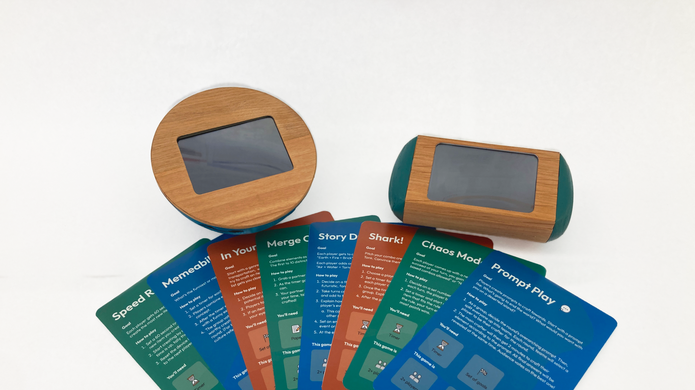

## About the project
This project aims to **combine tactile interaction with emerging technology** to create a dynamic and endlessly replayable game. 

Terra caters to an adult audience, hoping to bridge the gap between displayed gaming consoles and tangible board games. We utilized a human-centered, iterative approach to our design process. The end result, Terra, is **an engaging hybrid game that can also serve as a display object.**

## Context
Games are a staple part of many households in the US, with both physical board games as well as digital gaming systems. Focused primarily on digital gaming, the **global gaming industry was estimated to generate $184.4 billion in 2022.** 

However, in this wide industry of games, there is a curious **lack of successful hybrid physical-digital games.** The few well-known hybrid games, such as Bop It! or Keep Talking and Nobody Explodes, are quick trends within the gaming market, but quickly become repetitive and boring. Many of these hybrid games also boast brightly colored plastic enclosures, catering to a younger audience. 

## Role
For this project, I worked closely with Kayla Blalack, who has a mechanical engineering background. We collaborated closely on many parts of this project, though some of my notable contributions can be seen in:
- **Research & synthesis** to understand user needs and flows
- **AI experimentation** to craft for human-computer interactions
- **Electronics prototyping** to create a tactile working circuit of our prototype

| Design Team    | Tools   |
|:-------------|:-------------|
| Vishaka Nirmal | Figma        | 
|  Kayla Blalack | Prusa        | 
|            | Arduino  |
|            |              | 

## Research
Our primary research included both qualitative and quantitative data from an **observational study at two locations, informal surveys with 25 participants, and two in-depth user interviews.** 

From this research, we saw that:
- Memorable games create a sense of community within the group
- The visual aesthetics of most games are often too vibrant to fit into household aesthetics, leading to them being stored away. 
- Games that are highly replayable have a longer lifespan in gamer rotations

Building upon our understanding of the hybrid gaming context and our primary research findings, we aligned on our driving view throughout our ideation: **people repeatedly reach for party games that create a sense of camaraderie through energizing challenges.**

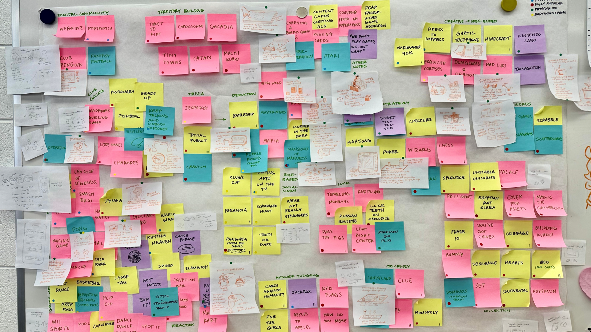

## Ideation
To begin, we conducted two rounds of sketching new game ideas that used existing successful elements from our research. 
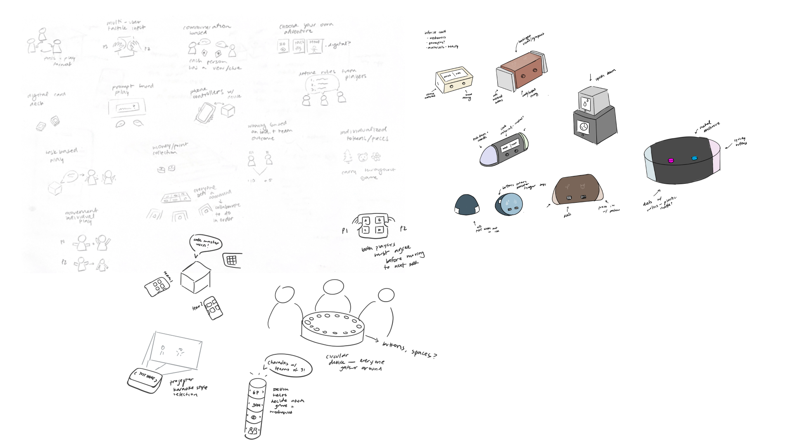

## Landing on a game mechanic
We prototyped many of our sketches, looking at form, function, and gameplay. As we narrowed down ideas, we used weighted rankings to quantitatively assess concepts and prototypes.

We landed on a high-risk, high-reward idea: **a game inspired by Infinite Craft.** This online web game by the developer Neal Agarwal became popular this past summer, collecting a fanbase with gameplay videos that collected millions of views. 

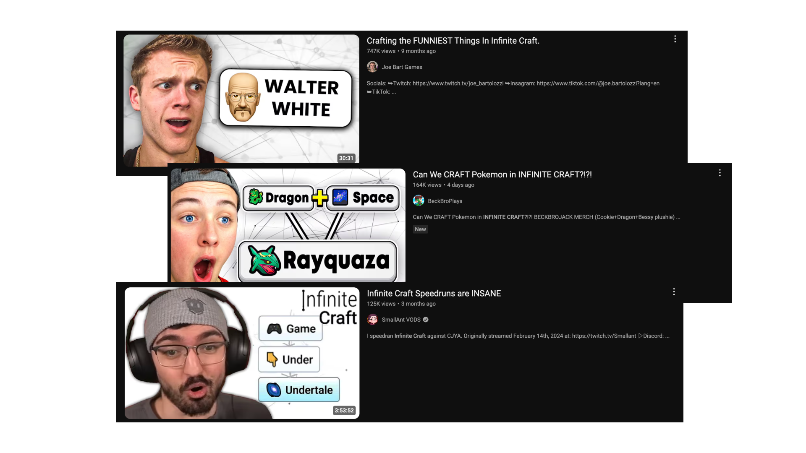

We wondered: how can we enhance this game within our view? **How might we bring a physical interaction to Infinite Craft-style gameplay, to efficiently combine tactile interaction with replayability?**

## Prototyping for tactile interaction 
We considered many form factors for potential physical interactions to enhance this game. Should the controllers be moldable? Which parts should be squishy? How should the item be held and squished for the most “primal” and satisfying feeling?

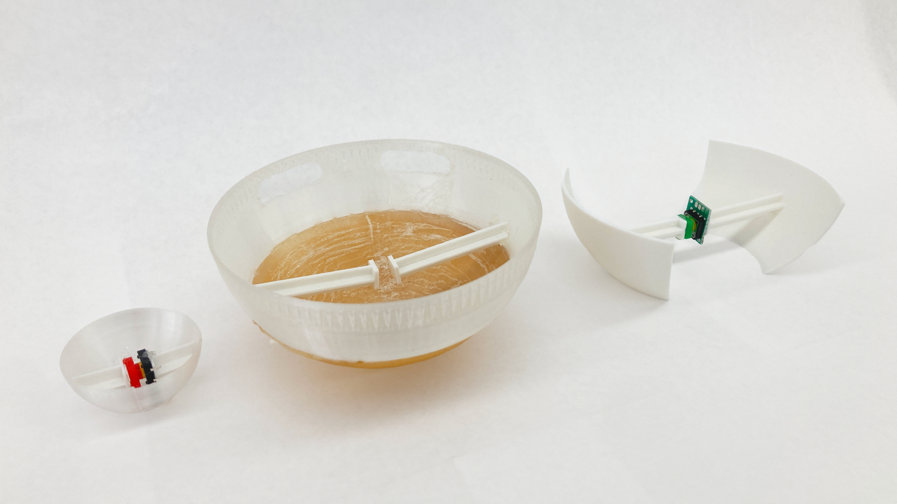

## Prototyping with AI
Alongside our physical prototypes, we began to experiment with an LLM to assist with combining elements and finding a proper resulting item. We tested out multiple versions of Llama, OpenAI, and Gemini to learn more about hosting on-edge models and sending requests to an API. 

While exploring each model, we engineered our prompt to be succinct and provide responses that our program could parse easily. The final prompt we used was: "What is semantically midway between ‘input 1‘ and ‘input 2‘. Respond with a single noun and provide a single emoji that best represents this noun." As we tested different versions of the models we could access, we saw that **the model affected whether responses resonated well with test users.** For example, when using the inputs “Water + Dog,” users preferred the response of “Otter” over the response of “River.”

## Validation
We tested initial prototypes primarily on members of the 20-person MADE cohort, but expanded into staff, friends, and family members. We handed users the prototypes and saw how they interacted with them. In particular, **we looked for the user's intuition about how to hold the object,** if it was clear where to squish, and if the form felt ergonomic. The feedback we received led us to narrow down to two primary forms, to shorten the pads on the side of the device, and to move the scroll wheels from the top surface to the back.

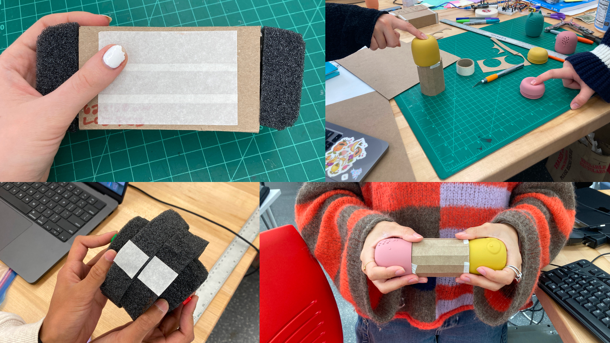

## Final Concept
For our final deliverable, we proposed two variations of our controller. One with a hemisphere shape, with a hard top plate and flexible dome shape below. There are two scroll wheels near the top of the enclosure, allowing users to rest their hands around the dome and rotate through their inventory on each side. After they choose the elements they want, **they squish both sides of the flexible dome to activate the internal button, which then requests a new element based on the combination.**

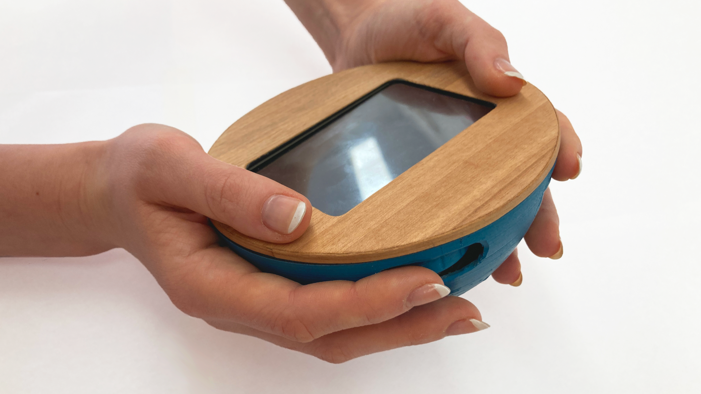

The second controller, is an alternative prototype in a semi-cylinder shape. Similarly, the scroll wheels sit at the top of the enclosure, where the users pointer fingers naturally rest while holding the device. Both sides of the device are made of a flexible material, **allowing the user to squish both palms inwards to combine elements.**

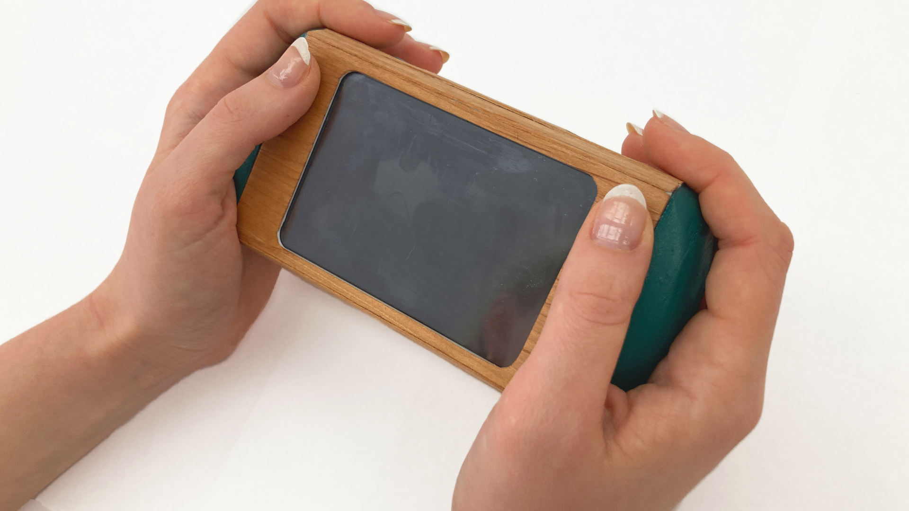

To accompany both controllers, **I designed a set of gameplay cards to guide users through using the controller** for a variety of purposes. Each card has simple instructions on how to set up the game, information on its collaborative/competitive nature, and any additional tools players may need. We envision these cards as a starting point for players to begin their crafting journey, and that each group of players will eventually create their own challenges and rules for gameplay. 

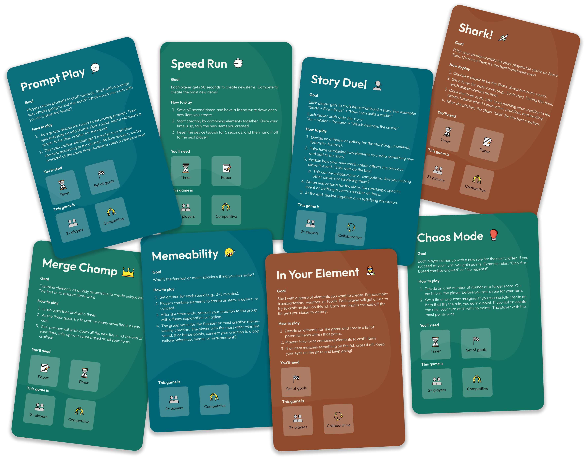

## Future Work
With the recent advent of AI accessibility, new games can take advantage of large language processing to create infinitely replayable, unexpectedly creative, and more dynamic games. However, **it is still uncommon to see physical games take advantage of AI capabilities.** This design is novel for increasing the engagement of an AI-based game via a physical interaction. 

On the other hand, we have created an object of play, that is tailored to our target consumer, giving it an adult sensibility. This is uncommon in the current game market. **It is also unexpected, considering how play is quickly associated with children and abandoned by adults.** The phrase “adult aesthetic” conjures neutral and muted tones, which are not overly energizing or playful. We seek to **challenge boredom while still making an object recognizably adult and decorative.** 

Lastly, we are excited to further test the suggested minigames and user interactions. While we based our game cards on common games played with Infinite Craft, we have not playtested them with our physical device. User input in a playtest environment will help narrow down the best modes of play for our device. Moving forward, we are ready to iterate on game designs in order to enhance camaraderie through energizing challenge. 

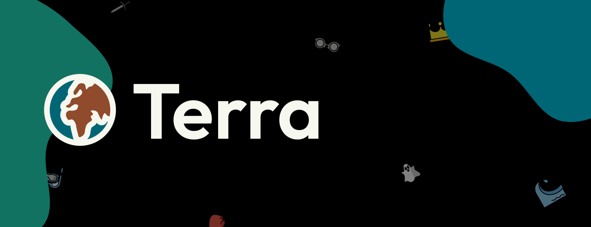

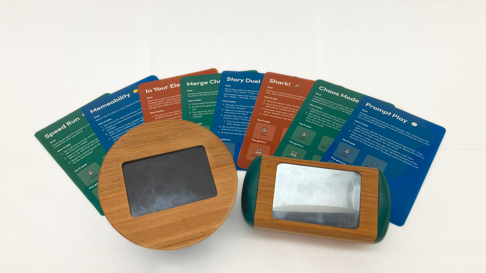
