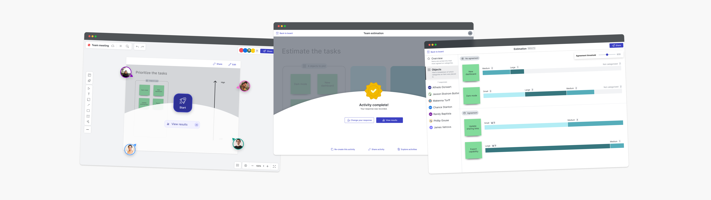
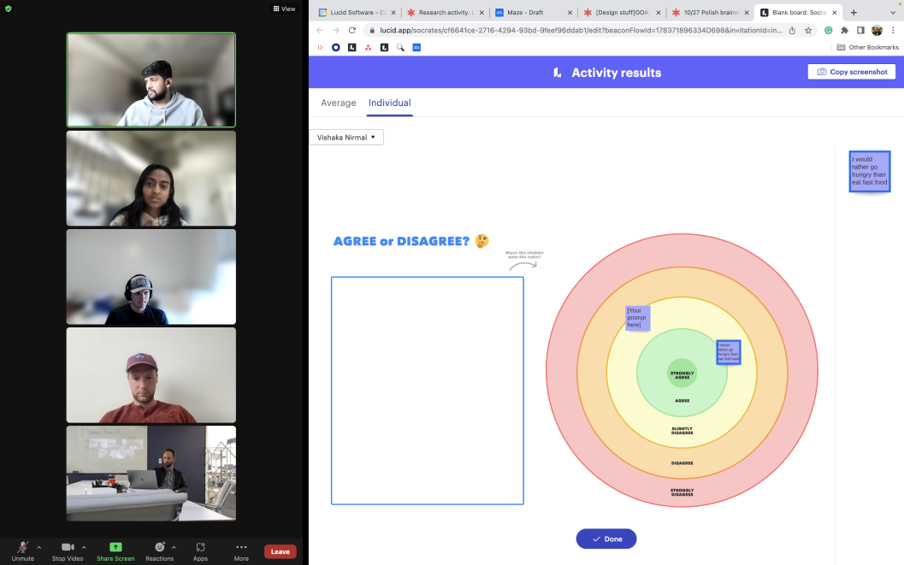
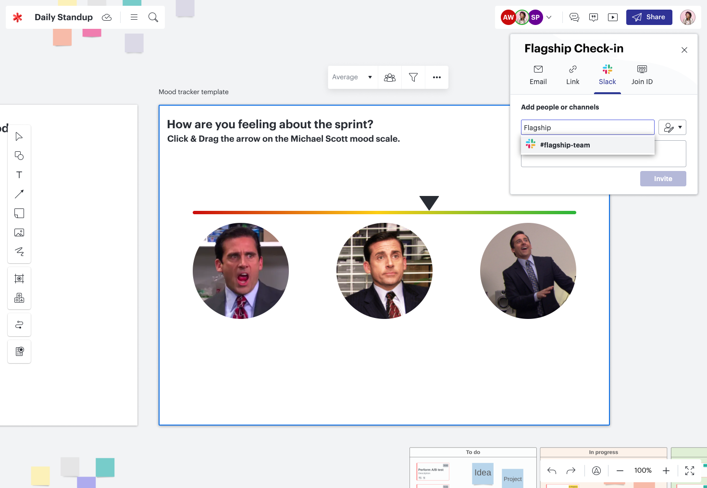
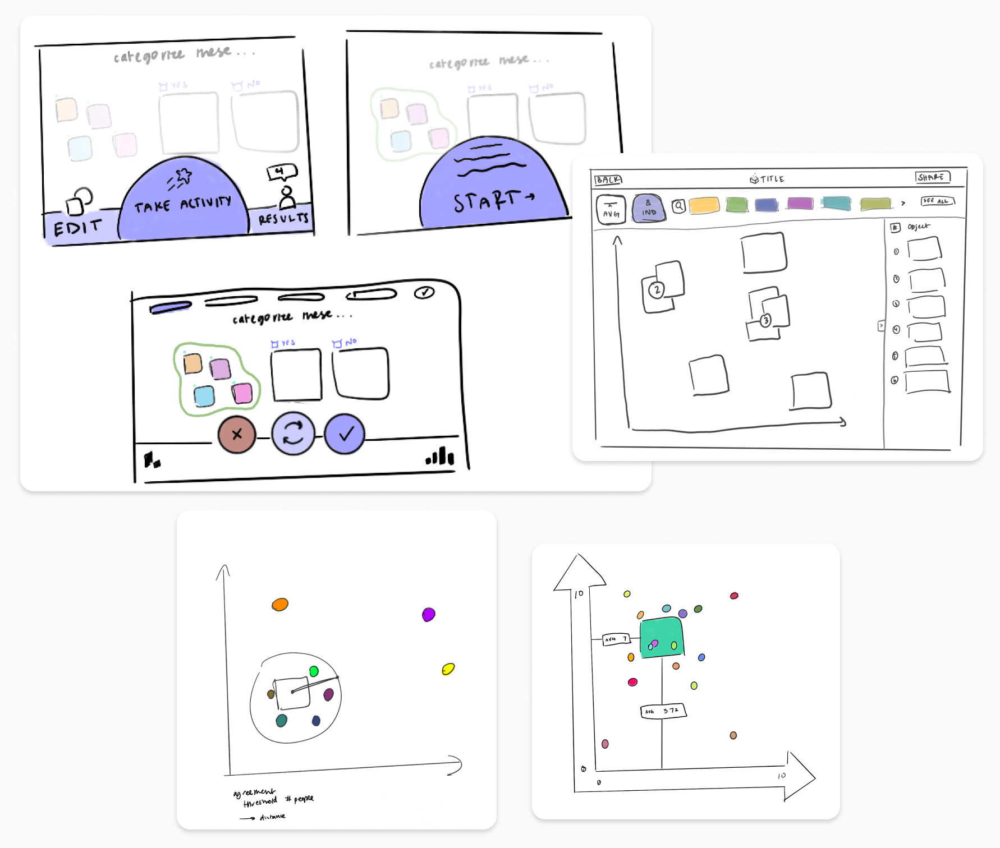
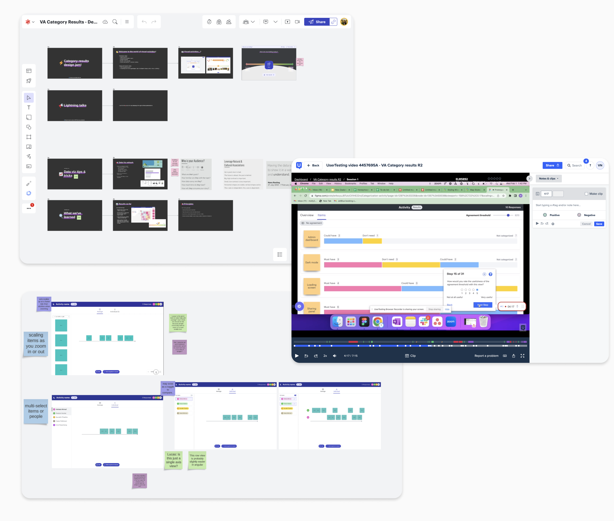

## Context
As a UX designer at Lucid Software, I researched and designed an on-canvas survey tool. The result of this year-long project is a visual survey that can be collaboratively created with digital shapes. To respond, each collaborator can individually manipulate the shapes to provide their opinion. 

I developed this tool along with product managers (Cole Rosenberg, Preston Hunter), designers (Saurabh Phadnis and Casey Robinson), and two engineering teams. This case study showcases our team effort, and my most significant contributions are seen in the activity shape and interactive results.

## My role

I developed this feature along with product managers (Cole Rosenberg, Preston Hunter), designers (Saurabh Phadnis and Casey Robinson), and two engineering teams. This case study showcases our team effort, and my most significant contributions are seen in the activity shape and interactive results.

## Initial concept

Feedback from our customers highlighted this desire for collaborative decision-making. This prompted our broad exploration: How can Lucid products better support and streamline team decision-making?
With this direction, our design team began cranking out conceptual mocks for the future. Alongside this work, our engineering counterparts began working on a coded prototype environment where we could test out designs.

## Early design iterations

My early ideation for the on-canvas survey shape began with sketching concepts. I mapped out how the activity shape could allow users to edit, participate, and view results. Similarly, I worked to sketch out the interactive results experience, drawing inspiration from data visualization tools.

## User feedback

As I designed, I gathered feedback from various audiences, working at the intersection of creativity, usability, and feasibility. I led two design jams with UX designers on various teams to gather new ideas. In early usability tests I ran through UserTesting.com, I learned how 20 users interacted with my Figma prototypes. Additionally, I often presented concepts to engineers on my team, gathering feedback on technical feasibility.

## Refined iterations
Creating a visual survey meant we were breaking a lot of paradigms. Instead of a Likert scale with a pre-defined scale and discrete values, we wanted the experience to feel freeform. 
My design work focused on:
- A shape-like canvas experience
- A freeform participant experience
- A data-driven results experience

## The on canvas shape
The final on-canvas activity shape has two states. We designed an 'edit mode' to allow the activity to be open to other content on the canvas. In this example, the 6 sticky notes are dragged into the activity shape while in edit mode. Each item gets a green hand hint to denote that it'll be interactive for participants in the activity. 
Once a user is done editing, they can save their changes, closing the activity. The activity now shows an overlay with a rocket-ship start button, allowing anyone on the whiteboard to participate. 

## Participation
I designed key pieces of the participation experience as users take a Visual Activity. Once users enter an activity, they’re brought into their mini-canvas, taking up their whole screen. With the top right corner, participants can see their avatar and "Responding as.." to know they're in their own space. 
Participants can find interactive objects by hovering over them and seeing objects react. Each collaborator plots objects on the activity and then can submit their response, getting a confirmation of their response.

## Results experience
I designed the interactive data visualizations seen in results. In the example shown here, 3 respondents have taken this activity. On the average view, all responses are placed in a calculated position. 
Hovering over each item showcases each collaborator's avatar, showing where they placed the item in relation to the average. 

## Outcomes
We released Visual Activities to all Lucid users in May 2023. If you're interested in trying it out, you can get started here.
What I learned most throughout this process was the benefits of quick iteration. We had a lot of ideas, got to test them out quickly, and saw what stuck. This helped us to build a new feature and innovative paradigm for gathering feedback in only a year! 