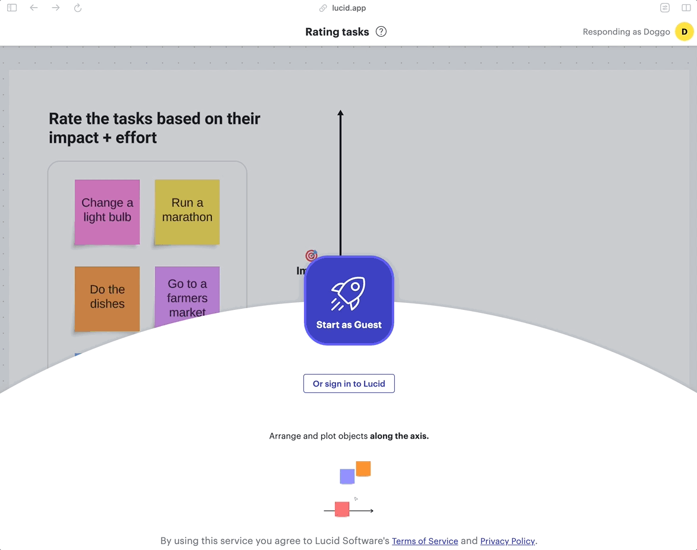

### Lucid Software
> Building a collaborative, on-canvas survey tool for Lucid users.

    

        
Context

        UX Designer II for Lucid Software
    

    

        
Impact

        Research, design, strategy, and project handoff. Launched in May 2023, now with over 28k monthly returning users.
    

    

        
Timeline

        May 2022 - May 2023 (1 year) 
    

>How can Lucid products better support and streamline team decision-making?
Visual Activities is a new, dynamic surveying tool that can be created, edited, and launched, all from the virtual canvas. Throughout this project, I helped to design key flows within the Visual Activities feature, including the on-canvas shape and results. **This feature launched to all users in May 2023, and now has an average of 28,000 users each month.**

## My contributions

    

        
Team

        Lead designer, working with 1 Product Manager, 3 Engineers, 1 QA.
    

    

        
Toolkit

        Figma, After Effects, UserTesting.com, Maze
    

Although I worked as the lead designer for my scrum team, I worked closely with 2 designers, Saurabh Phadnis and Casey Robinson, who worked on other parts of the feature on sister teams. In this specific project, notable parts of my main design process included:

  

    Synthesizing market research
    to outline key requirements for this new feature
  

  

    Collaborative ideation
    by running a collaborative design jam and creating new design paradigms
  

  

    Prototyping and testing
    to refine and iterate on our new canvas interactions
  

## Why create a surveying tool?
Lucid users often sought better ways to gather and visualize team feedback. In an online canvas, active collaborators can easily contribute to the discussion by adding shapes and sticky notes. However when making decisions, it becomes difficult to gather everyone’s perspective. A single decision maker may not capture everyone’s thoughts. 

## Market research & requirements
When starting this project, I worked closely with a tiger team (3 designers and 3 product managers across teams) to synthesize research from our Marketing and Strategic teams. We set up our aligning key requirements and capabilities for the solution:

  

   
Gather

Create a reusable, dynamic way to gather feedback from a team.
  

  

   
Organize

Allow participants to easily organize their thoughts visually. 
  

    

   
Analyze

Provide collaborators with digestible, actionable results. 
  

## Initial concept
Based on the feature's ideal requirements and capabiltiies, we set to create a space on the canvas to gather, organize, and analyze feedback. Ideally, the new feature would allow each participant to individually 'respond' by adjusting content in their own private canvas. 

## Ideation and sketches
As we refined the concept, some of the key features we needed to design for included: 

  

   
How do I use this shape on the canvas?

We needed to make the on-canvas experience distinct and understandable.
  

  

   
What happens with my data after the activity?

We needed to understand how to visually showcase this data well. 
  

Here are a few of my early sketches for the on-canvas shape and results visualizations: 

## Collaborative concept refinement
I helped lead various cross-functional meetings to ideate creative solutions to some of the complex technical constraints of on-canvas surveying. Here are examples of a design jam I led with the UX team (about 20 designers at the time), and a 'solutioning' meeting I led with my scrum team's engineers to discuss possibilities for the results visualizations. 

## Validation through user testing
Throughout this project, I had the opportunity to conduct many moderated validation with existing Lucid users under an NDA. These interviews helped to continously refine my mocks and prototypes. I was also able to host larger scale usability testing through UserTesting.com, where I would create unmoderated prototype tests and gather feedback from 10-20 participants at a time. Some of the specific testing surrounded:

  

   
The on-canvas shape

Did users know how to edit and launch each activity on the canvas?
  

  

   
Participation

Once in the activity, how did they know to interact with the right objects? 
  

    

   
Results

After finishing an activity, how did users analyze and use the results?
  

Within the results testing, I led a specific effort to design, prototype, and test how categorical activities would display results. Here's an example of this feedback on the UserTesting platform:

The various sources of user feedback provided many insights on specific improvements for our designs. Some of the notable takeaways for each part of the feature included: 

  

   
The on-canvas shape

The on-canvas shape was easy and inviting for participants to click the launch button, but users often had trouble editing their activities to their liking.  
  

  

   
Participation

Sometimes, participants didn't know how to interact with a survey, unsure which elements were interactive once they entered their private canvas. 
  

    

   
Results

Once users got to results, we saw that they wanted a quick overview of all responses, but also wanted to be able to dive into each individual's response to understand the spread of opinions better. 
  

## Final Designs
This feature, Visual Activities, officially launched in May 2023. We've continued refining the feature based on our user feedback, but the basis for Visual Activities allows users to create, deploy, and analyze surveys straight from their canvas. My key contributions for this solution include the on-canvas shape, participation experience, and the results experience. 

## On-canvas shape
The on-canvas activity shape has two states: an 'edit mode' for setup and a 'participation mode' for user interaction. In edit mode, users can drag content into the shape, preparing it for participant interaction. Once editing is complete, the shape transforms, inviting collaborators to engage.

## Responding to the survey
Participants enter their own mini-canvas, where they interact with the shapes to provide their responses. The design ensures clarity, with participants always aware of their active participation through visual cues like avatars and responsive objects.

## Results visualizations
The results visualization showcases each participant's input in relation to the group's average response. This interactive data visualization allows teams to quickly understand consensus or divergence in opinions, enhancing the decision-making process.

## Outcomes
Visual Activities launched to all Lucid users in May 2023 and quickly gained traction as a powerful tool for collaborative decision-making, now with over 150,000 uses each month. The iterative design process proved invaluable, allowing us to refine ideas rapidly and deliver a feature that meets user needs effectively. 

I had the opportunity to present use cases for this tool alongside my team during one of Lucid's webinars. [Watch the presentation here!](https://lucid.co/resources/webinars/use-cases-for-visual-activities-jan-2024)
