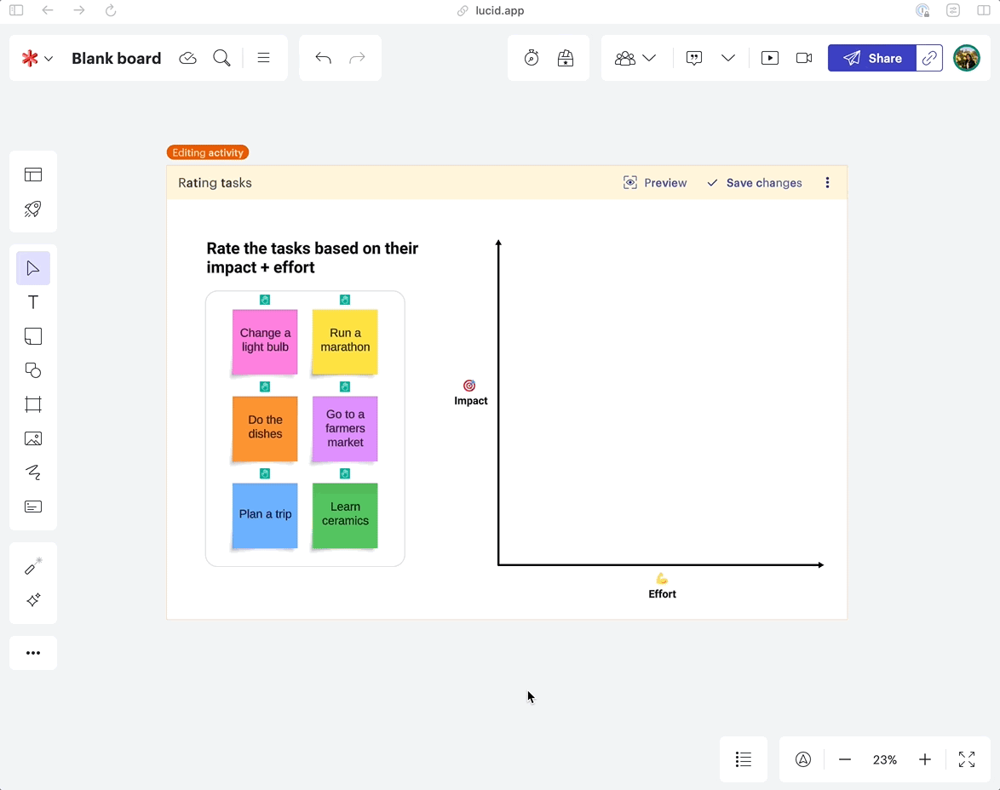

> Building a collaborative, on-canvas survey tool for Lucid users.

## Background
> Enhancing collaborative decision-making through visual interactions.

Lucid users often sought better ways to gather and visualize team feedback. The challenge was to create an on-canvas survey tool that allowed users to interact with digital shapes, facilitating a more engaging and intuitive decision-making process.

| Time     | Tools       | Design team    |
|:---------|:------------|:---------------|
| 12 months| Figma       | Vishaka Nirmal |
|          | Lucidchart  | Saurabh Phadnis|
|          | Lucidspark  | Casey Robinson |
|          | Maze        |                |

## Concept
> From customer feedback to an innovative survey experience.

The concept for Visual Activities originated from customer feedback, which emphasized the need for a more collaborative decision-making tool. We set out to explore how Lucid products could streamline this process, leading to the development of a visual survey tool that allowed each collaborator to manipulate shapes and provide input directly on the canvas.

## Research
> Validating our ideas with users and cross-functional teams.

Initial user research revealed that teams needed more flexible ways to make decisions collaboratively. To address this, I led design jams with UX designers across different teams and conducted early usability tests with 20 participants through UserTesting.com. These sessions provided valuable insights into how users interacted with the Figma prototypes and helped refine the tool's direction.

## Strategy
> Aligning with stakeholders and setting a clear roadmap.

With the concept validated, I led discussions with product managers and engineering teams to align our vision and secure investment in the Visual Activities feature. We outlined a strategic roadmap, focusing on creating a shape-like experience that felt both familiar and innovative for users.

## Iteration
> Refining the design through continuous feedback and testing.

Breaking traditional paradigms, we designed a freeform, shape-based survey experience. I iterated on the design, focusing on creating a seamless user experience that allowed for both participation and result visualization in a way that felt intuitive and engaging. 

## Final Designs
> Creating a dynamic and interactive survey tool.

The final design features an on-canvas activity shape with two states: an 'edit mode' for setup and a 'participation mode' for user interaction. In edit mode, users can drag content into the shape, preparing it for participant interaction. Once editing is complete, the shape transforms, inviting collaborators to engage.

Participants enter their own mini-canvas, where they interact with the shapes to provide their responses. The design ensures clarity, with participants always aware of their active participation through visual cues like avatars and responsive objects.

The results visualization showcases each participant's input in relation to the group's average response. This interactive data visualization allows teams to quickly understand consensus or divergence in opinions, enhancing the decision-making process.

## Outcomes
> Launching a new paradigm in collaborative feedback.

Visual Activities launched to all Lucid users in May 2023 and quickly gained traction as a powerful tool for collaborative decision-making. The iterative design process proved invaluable, allowing us to refine ideas rapidly and deliver a feature that meets user needs effectively. The success of Visual Activities showcases the potential for innovative, user-driven design in enhancing digital collaboration.

I had the opportunity to present use cases for this tool alongside my team during one of Lucid's webinars. [Watch the presentation here!](https://lucid.co/resources/webinars/use-cases-for-visual-activities-jan-2024)
