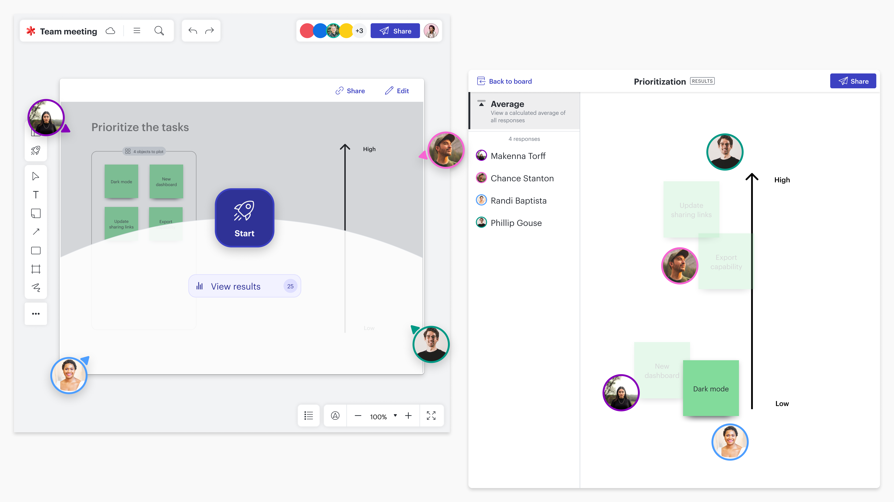

### Lucid Software
> Building a collaborative, on-canvas survey tool for Lucid users.

    

        
Context

        UX Designer II for Lucid Software
    

    

        
Impact

        Research, design, strategy, and project handoff. Launched in May 2023, now with over 28k monthly returning users.
    

    

        
Timeline

        May 2022 - May 2023 (1 year) 
    

## About the work
Throughout this project, I worked on a brand new feature for the Lucid suite of products, allowing teams to easily gather opinions and align on decisions. The result was a dynamic, on-canvas polling tool that allows Lucid collaborators to create, deploy, gather, and analyze surveys. This work was part of a strategic initiative to **help teams make collaborative decisions on the virtual canvas.** 

I worked as a lead designer for one of the 3 development teams working on this feature. I worked closely with 2 other designers, Saurabh Phadnis and Casey Robinson throughout this project. The final work can be seen live on any Lucid platform, and you can view a webinar I helped host about the feature [here.](https://lucid.co/resources/webinars/use-cases-for-visual-activities-jan-2024)

## The full case study
**If you have the password from my resume, you can take a look at my case study of this project [here](/visualactivities#content).**