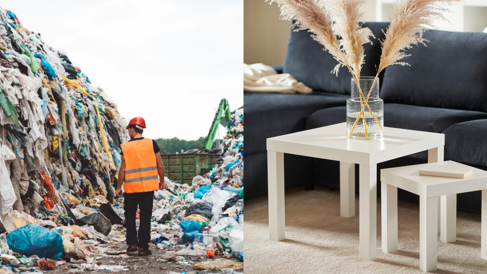
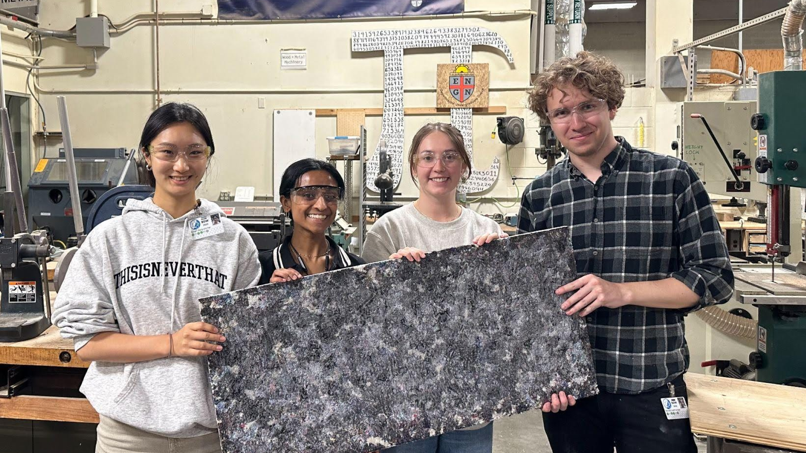
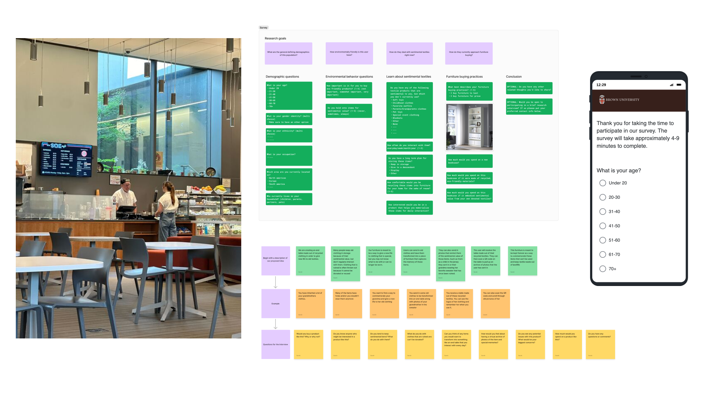
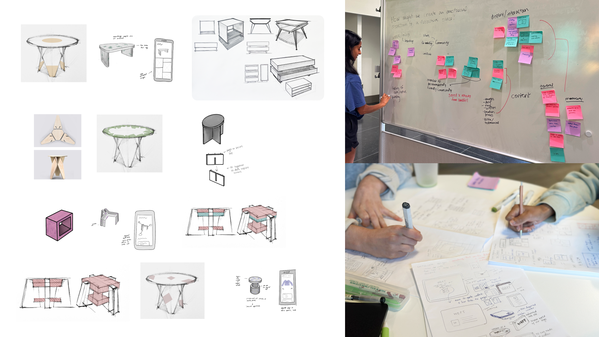
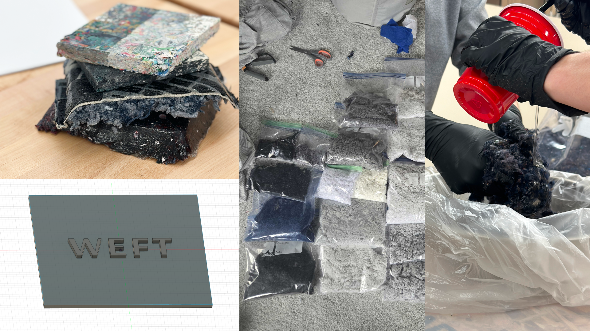
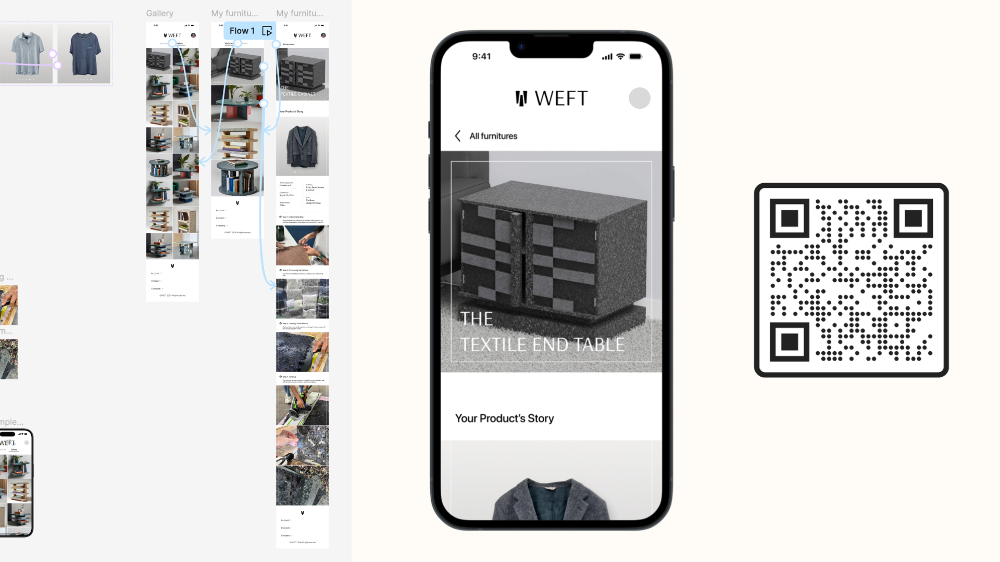
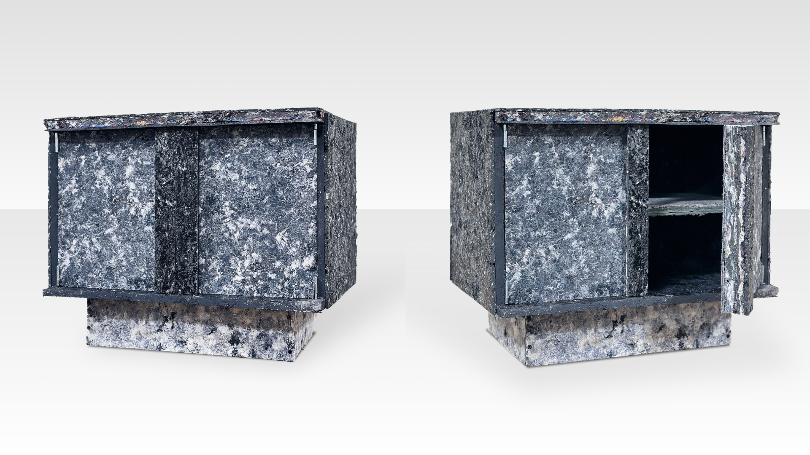

## Weft Furniture
> Developing a prototype for interactive, sustainability-driven furniture

| Role   | Time  |
|:-------------|:--------------------|
| Researcher + Designer @Brown University & RISD | June 2024 - August 2024 (2 months)|

## About the project
Weft Furniture was a project created during my time in the Brown/RISD Masters of Design Engineering program. This project involved a design process of market research, user studies, product ideation, and prototyping. 

The outcome was a **textile-board furniture prototype paired with a digital narrative tracing its origins**. This approach combines recycled materials with a digital storytelling platform to promote long-term product use and reduce waste.

This project will be presented at the **ACM Tangible and Embedded Information Conference** in Bordeaux, France, in March 2025. 

## Why design with textiles & furniture?
**11.3 million tons of textile waste and 12 million tons of furniture waste end up in U.S. landfills annually.** 

Our team began our project looking into large-scale problems in the world we could tackle. We landed on fast fashion as our intitial target, learning about recent companies that use textile waste to create art installations, such as Fabbrick. We then began to explore the questions--

>Could the combination of emotional connection and sustainability be a way to promote longer product lifespans?

## My role
| Team    | Toolkit   |
|:-------------|:-------------|
| Vishaka Nirmal| Figma, physical fabrication| 
|  Eunjin Hong |         | 
| Sarah Fletcher |   |
| Bennett Graff |              | 

The team went through the holistic research and design process together, but some of my notable contributions included:
- **Research & synthesis** to understand user needs and flows
- **Material prototyping** to create durable boards
- **Experience prototyping** to facilitate user interactions with the product

## Research into sustainability & purchasing
To understand sustainability attitudes, we surveyed **51 participants** and conducted **11 semi-structured interviews**. We focused our line of questioning onto how emotional connections might affect user perception on sustainable products.

From our research, we saw that: 
- The average self-rating for interest in sentimental products was 6.34/10 (1 being low interest, 10 being high)
- Emotional connection stems from items that "memorialize cherished moments," such as familial belongings, or event-specific clothing.

We then synthesized these findings, setting requirements for our design that would:
1. **Foster emotional connections** by documenting the story behind the original materials. 
2. **Encourage sustainable consumption** through durable, utility focused products. 

## Ideating on the experience opportunities
From our research findings, we decided to pursue a two-pronged prototype, including a textile-board created piece of furniture, along with a lasting storyline for that object. We then began to ideate on these two tracks:
1. **Sketches for possible furniture designs** that would be possible to create with textile-boards.
2. **Brainstorming and affinity diagramming on how users could interact with the storyline of each piece,** to deepen emotional connections.

## Prototyping the physical product
We developed many prototypes for the textile boards, experimenting with scrap sizes, adhesive amount, and compression amount. With our initial prototypes, we also tested the material strength of these boards by using various tools on them, including the bandsaw, drill press, and track saw.

## Prototyping the digital experience
To develop the storyline connected to each piece, we began by building a user journey map to identify key emotional touchpoints. We then ideated what platforms would be most accessible and long-lasting for this story to live on.

We landed on a mobile-first digital experience, that would be activated through a QR code or NFC tag connected to the piece of furniture. We then wireframed a platform where users can:
- **Scan a QR code** embedded in the furniture
- Access their **individualized digital story** of their product's journey

## Final concept
The final product combines **customizable furniture** with a **digital narrative**. Our prototype encourages long-term use by making each piece personal and meaningful. With this project, our prototype helps to contextualize the future of textile recycling as a viable building material. We hope to break the cycle of fast fashion and fast furniture, by creating memorialized products that hold a greater emotional value to the owner. 

<iframe width="560" height="315" src="https://www.youtube.com/embed/E5rVwSv8zpM?si=mdJBYMrUFEvoDqlh" title="YouTube video player" frameborder="0" allow="accelerometer; autoplay; clipboard-write; encrypted-media; gyroscope; picture-in-picture; web-share" referrerpolicy="strict-origin-when-cross-origin" allowfullscreen></iframe>

## Future iterations
This project was **accepted to the ACM Tangible and Embedded Interfaces conference, where my peers and I will be presenting this work in Bordeaux, France in March 2025.** Stay tuned for updates from this conference!

In terms of the project future, we aim to continue working on a couple parts of this work, including:
1. Using alternative adhesives: We aim to transition from resin to bio-based alternatives (e.g., lignin-based adhesives).
2. Testing material durability: How can we enhance weather resistance and load capacity?
3. Managing system scalability: How could this personalization be brought to a larger scale production?

